# 中山大学数据科学与计算机学院本科生实验报告
## （2018年秋季学期）
| 课程名称 | 手机平台应用开发 | 任课老师 | 郑贵锋 |
| :------------: | :-------------: | :------------: | :-------------: |
| 年级 | 2016 | 专业（方向） | 软件工程（电子政务） |
| 学号 | 16340301 | 姓名 | 赵俊祥 |
| 电话 | 15920804547 | Email | 1773133512@qq.com |
| 开始日期 | 2018.10.6 | 完成日期 |2018.10.16|

---

## 一、实验题目  中山大学智慧健康服务平台应用开发

---

## 二、实现内容

### 第四周任务：基本的UI界面设计

- 标题字体大小**20sp**，与顶部距离**20dp**，居中；
- 图片与上下控件的间距均为**20dp**，居中；
- 输入框整体距左右屏幕各间距**20dp**，内容（包括提示内容）如图所示，内容字体大小**18sp**；
- 按钮与输入框间距**10dp**，文字大小**18sp**。按钮背景框左右边框与文字间距**10dp**，上下边框与文字间距**5dp**，圆角半径**180dp**，背景色为**#3F51B5**；
- 四个单选按钮整体居中，与输入框间距10dp，字体大小**18sp**，各个单选按钮之间间距**10dp**，默认选中的按钮为第一个。

### 第五周任务：基础的事件处理

- 点击搜索按钮：
  - 如果搜索内容为空，弹出Toast信息“**搜索内容不能为空**”。
  - 如果搜索内容为“Health”，根据选中的RadioButton项弹出搜索成功对话框。 点击“确定”，弹出Toast信息——**对话框“确定”按钮被点击**。 点击“取消”，弹出Toast 信息——**对话框“取消”按钮被点击**。 
  - 否则弹出如下对话框，对话框点击效果同上。 
- RadioButton选择项切换：选择项切换之后，弹出Toast信息“**XX被选中**”，例如从图片切换到视频，弹出Toast信息“**视频被选中**”

### 第六周任务：Intent、Bundle的使用以及RecyclerView、ListView的应用

- 实现一个健康食品列表，有两个界面，第一个用于呈现食品列表，点击悬浮按钮可以切换到收藏夹。
- 上面两个列表点击任意一项后，可以看到详细的信息
-  长按列表中热任意一项，可以删除该项。
- 商品详情界面中点击返回图标会返回上一层。点击星标会切换状态，如果原本是空心星星，则会变成实心星星；原本是实心星星，则会变成空心星星。点击收藏图表则将该食品添加到收藏夹并弹出Toast提示 **"已收藏"** 。

---

## 三、实验结果
### (1)实验截图

#### 第四周实验截图

- 应用界面

    

#### 第五周实验截图

- 点击搜索按钮，当搜索内容为空时，提示“搜索内容不能为空”；当搜索内容不空也不是Health时，提示搜索失败。

  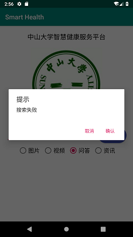


- 点击搜索按钮，当搜索内容为“Health”时，根据选中的内容提示“XX”搜索成功。

  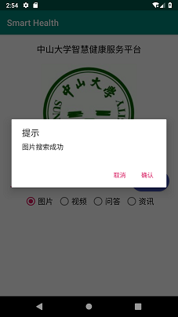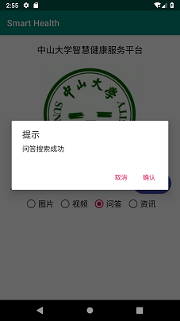 

- 点击确定按钮则提示“确定按钮被点击”；点击取消按钮则提示“取消按钮被点击”

   

  

- 切换不同选项则提示“XX被选中”

   

#### 第六周实验截图

- 食品列表和收藏夹界面，点击悬浮按钮可以实现两个界面的切换。

  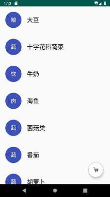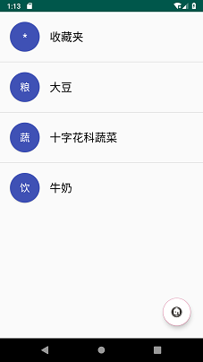

  

- 点击番茄这一项，跳转到番茄的详情页面，背景颜色与之对应，营养成分显示“番茄红素”。点击小车图片，弹出提示信息“已收藏”。在收藏夹中多出番茄这一项。

  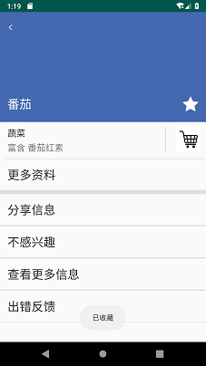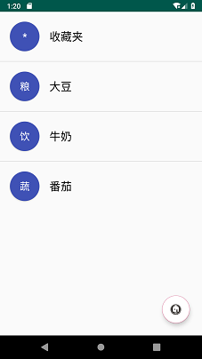

- 分别点击“海鱼”和“大豆”两项，进入对应的详情界面，背景颜色不同。点击星星图标，会变成实心星标。

  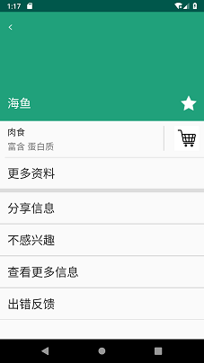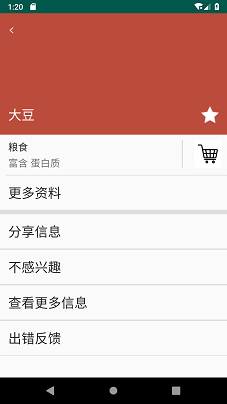

- 长按十字花科蔬菜。弹出对话框“确定删除十字花科蔬菜？”，点击确定后弹出消息“删除成功”。收藏夹列表中的十字花科蔬菜项消失。

  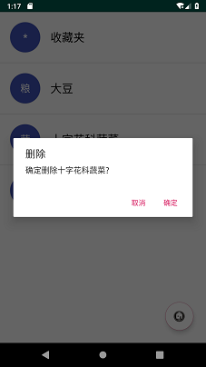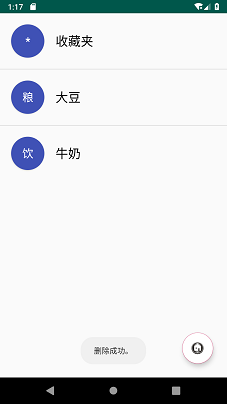


### (2)实验步骤以及关键代码

####      第四周内容

- 借助constraint layou实现控件之间的相对位置。在约束布局中，可以指定一个控件的四个边界与某个控件或者其父元素的边界对齐。例如要使标题居中，可以令其左右边界分别与应用界面的左右边界对齐，要令图片位于标题的下方，可以令其上边界与标题的下边界对齐，为了标明每个控件，可以给控件先赋一个id。

  ```java
  //设置id 
  android:id="@+id/title"
  //居中    
  app:layout_constraintLeft_toLeftOf="parent"
  app:layout_constraintRight_toRightOf="parent"
  //使图片位于标题下方
  app:layout_constraintTop_toBottomOf="@id/title"
  ```

- 实现Button控件的椭圆形状。首先新建一个btn_shape.xml文件，在这个文件中可以定义Button的背景颜色和圆角的度数。最后再把这个文件所定义的形状当作Button控件的背景即可。

  ```xml
  <shape xmlns:android="http://schemas.android.com/apk/res/android">
      <!--设置背景颜色-->
      <solid android:color="#3F51B5"/>
      <!--设置圆角-->
      <corners android:radius="180dp"/>
  </shape>
  
  android:background="@drawable/btn_shape"
  ```

- 实现单选按钮。使用一个RadioGroup，把四个RadioButton嵌套在里面即可。按钮的间隔可以用maring来实现，默认选中第一个按钮我是在java文件中用id获取到第一个按钮，然后调用setChecked函数将其置为true。

  ````xml
  <RadioGroup>
      <RadioButton
          android:id="@+id/btn1"
          android:layout_marginRight="10dp"/>
      ...
      <RadioButton.../>
  </RadioGroup>
  
  RadioButton defaultBtn = (RadioButton)findViewById(R.id.btn1);
  defaultBtn.setChecked(true);
  ````

####      第五周内容

- 点击搜索按钮，根据不同的搜索内容弹出不同的信息。首先借助id获取到Button这个元素，然后用setOnClickListener()为其添加一个监听函数。在监听函数中，首先获取到EditText的输入内容，当输入为空时，直接调用Toast.makeText函数弹出信息“搜索内容不能为空”；当输入为"Health"时，使用AlertDialog来弹出对话框。由于要根据选中的按钮弹出不同的对话框，需要获取到当前被选中的按钮是哪一个，并将其text内容加到对话框的标题中，可以用findViewById(radioGroup.getCheckedRadioButtonId())来获取到被选中的按钮。对话框点击确定或取消按钮后的响应可以在setPossitiveButton和setNegetiveButton中进行设置。

  ````java
  if(editText.getText().toString().equals("")){
    Toast.makeText(getApplicationContext(), "搜索内容不能为空", Toast.LENGTH_SHORT).show();}
  final AlertDialog.Builder alertDialog = new AlertDialog.Builder(MainActivity.this);
  alertDialog.setTitle().setMessage().setPossitiveButton(...).setNegetiveButton(...).show();
  ````

- 实现按钮切换时弹出不同的提示信息：首先用id获取到RadioGroup这个控件，然后给它添加监听函数，在监听函数中用findViewById(checkedId)获取到被选中的按钮的text内容，添加到Toast信息之中再弹出即可。

  ````java
  radioGroup.setOnCheckedChangeListener(new RadioGroup.OnCheckedChangeListener() {
     @Override
     public void onCheckedChanged(RadioGroup group, int checkedId) {
          RadioButton checkedBtn = (RadioButton)findViewById(checkedId);
          Toast.makeText(getApplicationContext(), checkedBtn.getText().toString() + "被选中", Toast.LENGTH_SHORT).show();
     }
  });
  ````

#### 第六周内容

- 本次实验没有新建一个项目，而是在上次实验的基础上，添加了一个按钮，点击按钮后跳转到本次实验的界面。实现方法是新建一个intent，参数指明为MainActivity和RecyclerActivity，表示从上次实验的界面跳转到食品列表。

  ````java
  Intent intent =new Intent(MainActivity.this,RecyclerActivity.class);
  startActivity(intent);
  ````

- 本次实验涉及到多个界面的跳转，由于一开始TA的教程中没有说明用了多少个布局文件和类文件，我是为每个界面都单独创建了布局文件和对应的Activity，recycler.xml和RecyclerActivity.java对应食品列表，listview.xml和ListViewActivity对应收藏夹列表，details.xml和DetailActivity.java对应详情页面，item.xml用来涉及列表中每一项的格式。同时新建了一个Food类来封装食物的所有信息和get(), set()方法。由于要求中详情页面的最后四行也要用ListView实现，所以还新建了一个operations.xml。

- 首先是用RecyclerView实现食品列表，先根据TA给的教程，完成MyViewHolder和MyRecyclerViewAdapter两个类。ViewHolder用来存放食品列表中的每一项，MyRecyclerViewAdapter相当于一个适配器。完成这两个类后，在RecyclerActivity中用id获取到recyclerView，再new一个Food类型的列表data，把所有食物信息填入其中，然后用这个data去创建adapter，这时就可以将食品列表显示出来了。

  ````java
  RecyclerView recyclerView = (RecyclerView)findViewById(R.id.recyclerView);
  private List<Food> data；
  data = new ArrayList<Food>();
  data.add(new Food("大豆","粮","粮食","蛋白质","#BB4C3B"));
  ......
  myAdapter = new MyRecyclerViewAdapter<Food>(RecyclerActivity.this, R.layout.item, data){...}
  recyclerView.setAdapter((scaleInAnimationAdapter));
  ````

- 实现列表项的点击事件。给适配器添加setOnItemClickListener监听器，在onClick中实现单击事件，跳转到详情界面同样用intent实现。为了把食品的信息传递过去，需要借助Bundle来存放数据。Food类在声明时必须先加上implements Serializable ，然后才能用Bundle的putSerializable方法把数据放进去。存好数据后，用startActivityForResult启动intent，这样就能跳转到详情界面。跳转成功后，需要取出数据，使用intent的getSerializableExtra方法得到传递过来的对象，把对象的信息赋给相对应的控件。同时，由于圆圈部分是用Button实现的，点击圆圈时无法触发listview的点击事件，所以可以在item.xml文件中加入一句android:descendantFocusability="blocksDescendants"来解决这个问题。

  ````java
  //传递数据
  Intent intent = new Intent(RecyclerActivity.this, DetailActivity.class);
  Bundle bundle = new Bundle();
  bundle.putSerializable("food",data.get(position));
  intent.putExtras(bundle);
  startActivityForResult(intent, 1);
  //获取数据
  Intent intent = getIntent();
  final Food food = (Food)intent.getSerializableExtra("food");
  TextView detailName = (TextView)findViewById(R.id.detail_name);
  detailName.setText(food.getName());
  RelativeLayout layout = (RelativeLayout)findViewById(R.id.topLayout);
  layout.setBackgroundColor(Color.parseColor(food.getColor()));
  ````

- 实现列表的长按事件。在onLongClick函数中弹出AlertDialog，点击确定后调用data的remove函数，然后调用adapter的notifyDataSetChanged()函数即可。

  ````java
  data.remove(_position);
  myAdapter.notifyDataSetChanged();
  ````

- 用ListView实现收藏夹界面。ListIView的实现同样需要一个适配器，按照TA的教程完成即可。不过需要添加一个refresh()方法，在里面更新ListView的列表，然后调用notifyDataSetChanged函数。

  ````java
  public void refresh(List<Food> _list){
      list = _list;
      notifyDataSetChanged();
  }
  ````

- 实现悬浮按钮切换界面的功能。给FloatingActionButton添加监听器，在监听器中，用intent进行页面跳转。在食品列表点击食品项后也可以进行收藏，所以我在recyclerActivity中也定义了一个Food类型的list来保存已收藏的食品。跳转前，把这个列表存进bundle中，然后传递给收藏夹界面。在listview中，获取到recyclerView传递的intent并把数据提取出来，用于初始化界面即可。当在收藏夹页面点击悬浮按钮时，调用finish函数来回到食品界面。不过在调用finish函数之前，需要把收藏夹界面的list再放进intent中传回去，这样才能保证两个界面的收藏信息是一致的。

  ````java
  //传递数据
  bundle.putSerializable("collectedFood",(Serializable)collectedFood);
  intent.putExtras(bundle);
  startActivityForResult(intent, 2);
  //收藏夹返回食品列表
  resultIntent.putExtras(bundle);
  setResult(4,resultIntent);
  finish();
  //接收回复
  if(requestCode == 2){
      if(resultCode == 4){
          List<Food> backList = (List<Food>)data.getSerializableExtra("backList");
          collectedFood = backList;
      }
  }
  ````


- 实现详情列表的布局。使用两个RelativeLayout实现上面部分和下面部分，把上面的layout_weight设置为1，下面的设置为2，上面部分就可以占1/3了。几个图标的位置可以用layout_alignParent属性来实现，使得返回图片位于左上角，以此类推。更多操作下面的四项用listview实现，需要再定义一个adapter，修改一下对应的控件即可。

  ````xml
  <RelativeLayout
  	android:layout_weight="1">
  //使返回按钮位于左上角
  <ImageView
  	android:layout_alignParentTop="true"
  	android:layout_alignParentLeft="true"/>
  
  ````

- 实现星标变换，收藏和返回功能。给星标设置一个tag，初始化为0。处理点击事件时，如果tag为0，则将星标替换成实心，tag设为1。否则替换成空心，tag设为0。收藏功能需要将对应的food的isCollected属性置为true，然后就把这个food的信息放进bundle中，调用setResult函数把intent传递回去。在点击返回按钮时，调用finish函数，通过这种方式，点击收藏按钮后，即使不是点击左上角返回按钮，也可以改变收藏夹内容。

  ````
  if((int)star.getTag() == 0){
  	star.setImageDrawable(getResources().getDrawable(R.drawable.full_star));
  	star.setTag(1);
  }
  if(food.getIsCollected() == true){
      ...
      resultIntent.putExtras(bundle);
      setResult(3,resultIntent);
      food.setIsCollected(false);
      finish();
  }
  ````

  

### (3)实验遇到的困难以及解决思路

#### 第四周

- 在设置EditText的宽度时，不知道怎样让它把整个空间填满，使用wrap_content的话横线的长度只会包含文字内容，无法填满。后来看了教程后才知道将width设置为0dp就可以使其填满整个空间。还有一开始EditText的提示内容我是用text设置的，然后再去设置颜色。后来才发现EditText有hint这个属性，直接使用就可以了。
- 设置Button的圆角时，给Button控件设置radio属性时发现只能设置阴影的圆角。上网查了相关资料才发现要另外建立以xml文件来定义Button的形状，然后把定义好的形状作为Button的background就能实现椭圆形的效果了。
- 设置默认选中第一个按钮的时候，一开始我是直接把第一个按钮的checked属性置为true，但这样做RadioGroup可以选中两个按钮，而且第一个按钮的选中状态无法取消。最后的解决思路是在java文件中获取到第一个按钮，然后调用setChecked（）。

#### 第五周

- 点击搜索按钮弹出对话框，一开始使用了AlertDialog.create函数，发现点击后并没有弹出对话框，查了相关资料后才明白，create只能创建对话框，而show才能弹出对话框。一般情况下，直接使用show函数就可以创建并弹出对话框了，所以我直接使用了show()。
- 判断搜索内容是否为空时，一开始是用==来比较的，但不管怎么测试都不会弹出”搜索内容不能为空“。后来才知道，在java中，用==比较复合数据类型（string就是复合数据类型）时，比较的是他们在内存中的地址，所以比较的结果一直是false。比较复合数据类型时应该使用equal()，修改后问题就解决了。

#### 第六周

- 页面跳转时出现闪退的情况，解决方法是先在AndroidManifest.xml中注册新的activity。
- 由于我是把食品列表和收藏夹放到不同的布局文件，并用不用的activity进行控制的，所以在食品列表进入详情页并收藏后，收藏夹无法得知哪些食物被收藏了。所以只能采用效率比较低的方法，把收藏的食物信息在recyclerActivity中保存起来，等跳转到收藏夹时才传递过去。
- 每当重新进入收藏夹时，会调用listviewActivity的onCreate函数，这样之前收藏进去的食品信息就被清空了。解决办法是从收藏夹页面回到食品界面前，把对收藏夹的修改传回给食品列表，保证两者的一致性。当再次进入收藏夹时，把食品列表关于收藏食品的信息传递过去，这样尽管调用了onCreate函数，也可以把信息保存下来。当然这种方法的效率比较低，应该不是最优解。
- 收藏夹中删除食品后没有效果。本来的做法是在长按函数中调用remove函数并notifyDataSetChanged，但是并没有用。仔细看了教程后才知道，在listAdapter中写一个refresh函数，把list传进去修改后，在里面调用notifyDataSetChanged函数才是有效的。


---

## 四、实验思考及感想

在做第四周作业的时候，很多布局都是直接输入代码来控制的，没有使用到AS提供的设计界面，像设置控件之间的相对位置，其实都可以直接在设计界面里建立约束关系的，AS会自动生成相应的代码，感觉这次有点浪费这个工具了。不过由于之前有学过一点Web和UWP开发，很多界面设计的东西都挺类似的，所以完成起来还比较顺利。第五周作业完成了一些基础的事件处理，主要学习了事件监听器的使用，遇到的问题不多，主要是因为一开始没发现TA有给一个教程，所以自己去查花了比较多时间。

第六周的内容非常多，一开始做的时候，想的是有三个界面，理所应当就创建了三个独立的布局文件和java文件。看似很有条理，但在后面做跳转和收藏的时候带来了巨多问题。例如如何把食品列表收藏的食品信息传递给收藏夹，如果按照TA的做法，把食品列表和收藏夹写在一起，用setVisibilty来控制显示哪个，就可以省去传递数据的麻烦了，不过TA更新教程的时候我已经写了很多内容了，觉得改文件结构很麻烦就没用那种方法了。除了这个大坑之外，收藏夹界面每次都会调用onCreate函数也是我认为做的不好的地方。其实做的时候有查过几种不调用onCreate的方法，例如重写onNewIntent方法，只是尝试后又遇到了很多新问题，无奈放弃了。最后就是写代码时习惯先帮界面都做好再来处理逻辑部分，我觉得这是个不好的习惯，在最开始就把各种逻辑问题处理好，及时发现问题并解决它，这样才能避免后期遇到很多难以解决的bug。