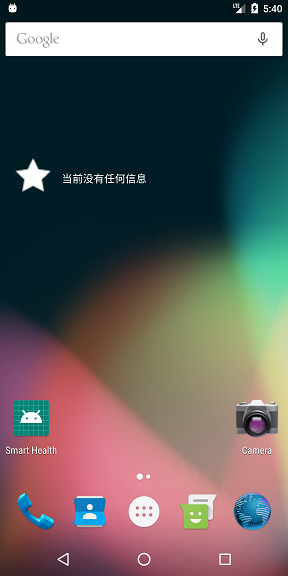

# g中山大学数据科学与计算机学院本科生实验报告
## （2018年秋季学期）
| 课程名称 | 手机平台应用开发 | 任课老师 | 郑贵锋 |
| :------------: | :-------------: | :------------: | :-------------: |
| 年级 | 2016级 | 专业（方向） | 软件工程（电子政务） |
| 学号 | 16340301 | 姓名 | 赵俊祥 |
| 电话 | 15920804547 | Email | 1773133512@qq.com |
| 开始日期 | 10.22 | 完成日期 |10.23|

---

## 一、实验题目 中山大学智慧健康服务平台应用开发

---

## 二、实现内容

### 第七周

- 静态广播：启动应用是否有随机推荐食品的通知产生。点击通知是否正确跳转到所推荐食品的详情界面。
- 动态广播：点击收藏后是否有提示食品已加入收藏列表的通知产生。同时注意设置launchMode。点击通知是否跳转到收藏列表。
- Eventbus:点击收藏列表图标是否正确添加食品到收藏列表。每点击一次,添加对应的一个食品到收藏列表并产生一条通知。

### 第八周

- 初始状态widget显示 “没有任何信息”，点击widget启动应用。
- 静态广播：启动应用Widget随机推荐食品，点击跳转至对应的详情页。
- 动态广播：点击收藏图标后，Widget提示食品已加入收藏列表，点击跳转至收藏夹页面。

---

## 三、实验结果
### (1)实验截图

#### 第七周

- 启动应用时随机弹出推荐食品的通知，点击通知后跳转到所推荐的食品详情界面。

   

  

- 在牛奶的详情界面点击收藏按钮后弹出“已收藏牛奶”的通知，点击通知后跳转到收藏夹界面，可以看到“牛奶”这一项。

   

  

- 在“海鱼”界面点击两次收藏按钮，弹出两个通知，点击通知后跳转到收藏夹界面，多出两项“海鱼“。

   

#### 第八周

- Widget初始状态为“当前没有任何信息“，点击后启动应用。

   

- 启动应用后Widget显示今日推荐，点击跳转到详情界面

   

- 点击收藏按钮后，Widget显示”已收藏 XXX“，点击跳转到收藏夹

   

### (2)实验步骤以及关键代码

#### 第七周

- 定义、注册、发送静态广播	。首先根据教程定义一个StaticReceiver类并在AndroidManifest.xml中注册这个接收器。注册完成后在主界面的activity中发送广播。发送广播时，先用Random.nextInt生成一个0到列表长度-1的整数，然后把对应下表的Food存进bundle中，再用putExtras存进Intent中后发送广播。

  ````java
  //生成随机数
  Random random = new Random();
  int ranNum = random.nextInt(data.size());
  bundles.putSerializable("food",data.get(ranNum));
  intentBroadcast.putExtras(bundles);
  sendBroadcast(intentBroadcast);
  ````

- 在onReceive函数中接收静态广播并弹出通知。在onReceive中获取到传递过来的intent，提取出传递的食品信息。新建一个Notification.Builder，然后设置标题、内容和图标等信息。为了使得点击通知后跳转到对应的详情界面，同样需要把食品信息存进bundle中，然后用PendingIntent.getActivity() 跳转到详情界面。最后获取通知栏管理者，绑定Notification发送通知即可。

  ````java
  //获取信息并设置通知内容
  Food food = (Food)intent.getExtras().getSerializable("food");
  builder.setContentTitle("今日推荐").setContentText(food.getName()).setTicker("您有一条新消息")
  .setSmallIcon(R.mipmap.empty_star).setAutoCancel(true);
  //点击通知跳转
  PendingIntent myPendingIntent = PendingIntent.getActivity(context,0,myIntent,PendingIntent.FLAG_UPDATE_CURRENT);
  builder.setContentIntent(myPendingIntent);
  ````

- 实现动态广播。首先定义DynamicReceiver类，用类似静态广播的方法重写onReceive函数。由于点击多次后要产生多条通知，所以在notify函数中要把第一个参数设置成不同的id，这样才能出现多条通知。然后在收藏按钮的处理函数中注册并发送动态广播。

  ````java
  //使用不同id
  Notification notify = builder.build();
  manager.notify(count,notify);
  count++;
  //注册动态广播
  if(dynamicReceiver == null){
      IntentFilter dynamic_filter = new IntentFilter();
      dynamic_filter.addAction("com.example.hasee.myapplication2.MyDynamicFilter");
      dynamicReceiver = new DynamicReceiver();
      registerReceiver(dynamicReceiver, dynamic_filter);
  }
  ````

- 利用EventBus传递信息并更新收藏夹。首先定义MessageEvent类，封装一个Food类型的私有变量，一个构造函数和getFood函数。接着在MainActivity中注册订阅者，并声明订阅方法onMessageEvent函数来处理收到的信息。在onMessageEvent中调用getFood函数获取到收藏的食品，存进collectedFood列表中并调用适配器的refresh函数。最后在收藏按钮的函数中调用传递事件。

  ````java
  //订阅
  EventBus.getDefault().register(this);
  //处理函数
  @Subscribe(threadMode = ThreadMode.MAIN)
      public void onMessageEvent(MessageEvent event) {
          Food f = (Food) event.getFood();
          collectedFood.add(f);
          listViewAdapter.refresh(collectedFood);
      };
  //发送
  EventBus.getDefault().post(new MessageEvent(food));
  ````

- 点击动态广播通知跳转到收藏夹。跳转同样用PendingIntent.getActivity() 实现，但是要在mainActivity中重写onNewIntent方法，防止重复执行onCreate函数。在onNewIntent里设置食品列表不可见，设置收藏夹为VISIBLE并更换悬浮按钮的图片。

  ````java
  @Override
  protected void onNewIntent(Intent intent){
      super.onNewIntent(intent);
      setIntent(intent);
      RecyclerView recyclerView = (RecyclerView)findViewById(R.id.recyclerView);
      recyclerView.setVisibility(View.GONE);
      ListView listView = (ListView)findViewById(R.id.listView);
      listView.setVisibility(View.VISIBLE);
      flag = false;
      FloatingActionButton btn = (FloatingActionButton)findViewById(R.id.btn);
      btn.setImageResource(R.drawable.mainpage);
  }
  ````


#### 第八周

- 创建Widget类，进入模拟器把对应的Widget拖动到桌面上，然后修改Widget的布局文件new_app_widget.xml和属性文件new_app_widget_info.xml。在布局文件添加一个ImageView和TextView，把Textview的相对位置设置在ImageView的右边，把整个layout的background设置为"#00000000"实现背景透明。

  ````xml
  <TextView
       android:id="@+id/appwidget_text"
       android:layout_alignLeft="@+id/widget_image"
       ...
       />
  ````

  

- 实现点击widget启动应用。在NewAppWidget.java文件中，重写onUpdate方法。使用RemoteViews获取到主屏幕的view。使用PendingIntent的getActivity方法来实现跳转到应用的主界面。最后在获取到的view上setOnClickPendingIntent，用appWidgetManager更新widget。

  ````java
  RemoteViews updateView = new RemoteViews(context.getPackageName(), R.layout.new_app_widget);//实例化RemoteView,，
  Intent i = new Intent(context, MainActivity.class);
  PendingIntent pi = PendingIntent.getActivity(context, 0, i, PendingIntent.FLAG_UPDATE_CURRENT);
  updateView.setOnClickPendingIntent(R.id.widget_image, pi); //设置点击事件
  ComponentName me = new ComponentName(context, NewAppWidget.class);
  appWidgetManager.updateAppWidget(me, updateView);
  ````

- 重写onReceive方法，实现Widget内容更改和跳转到详情界面。通过bundel获取到广播传递过来的数据，用RemoteViews获取到主屏幕上的Widget，用setTextViewText修改显示内容，然后依然用PendingIntent.getActivity跳转到DetailActivity，即详情界面。最后在获取到的view上setOnClickPendingIntent，添加新的点击事件，用appWidgetManager更新widget。

  ````java
   if(intent.getAction().equals(WIDGETSTATICACTION)){
       Food food = (Food)bundle.getSerializable("food");
       RemoteViews views = new RemoteViews(context.getPackageName(), R.layout.new_app_widget);
       views.setTextViewText(R.id.appwidget_text, "今日推荐 " + food.getName());
       views.setImageViewResource(R.id.widget_image,R.mipmap.full_star);
       Intent i = new Intent(context,DetailActivity.class);
       i.putExtras(bundle);
       PendingIntent pi = PendingIntent.getActivity(context, 0, i, PendingIntent.FLAG_UPDATE_CURRENT);
       views.setOnClickPendingIntent(R.id.widget_image, pi); //设置点击事件
       ComponentName me = new ComponentName(context, NewAppWidget.class);
       appWidgetManager.updateAppWidget(me,views);
   }
  ````

- 注册，发送静态广播。在manifest.xml文件中注册newAppWidget的接收器，在MainActivity的onCreate函数中，用Random类产生随机数，然后发送静态广播。

  ````java
  Intent widgetIntentBroadcast = new Intent();       widgetIntentBroadcast.setAction("com.example.hasee.myapplication2.MyWidgetStaticFilter");
  widgetIntentBroadcast.putExtras(bundles);
  sendBroadcast(widgetIntentBroadcast);
  ````

- 实现动态广播。在DynamicReceiver类的onReceive函数中，加入处理widget广播的部分。通过bundel获取到广播传递过来的数据，用RemoteViews获取到主屏幕上的Widget，用setTextViewText修改显示内容，然后用PendingIntent.getActivity跳转到MainActivity，即收藏夹页面。最后在收藏按钮的处理函数中注册并发送动态广播。使用完动态广播后，在onDestroy函数中注销接收器。

  ````java
  //接收函数
  if (intent.getAction().equals(WIDGETDYNAMICACTION)){
      Food food = (Food)bundle.getSerializable("food");
      RemoteViews views = new RemoteViews(context.getPackageName(), R.layout.new_app_widget);
      views.setTextViewText(R.id.appwidget_text, "已收藏 " + food.getName());
      Intent i = new Intent(context,MainActivity.class);
      PendingIntent pi = PendingIntent.getActivity(context, 0, i, PendingIntent.FLAG_UPDATE_CURRENT);
      views.setOnClickPendingIntent(R.id.widget_image, pi); //设置点击事件
      
  }
  //注册widget动态广播
  if(widgetDynamicReceiver == null){
      IntentFilter widget_dynamic_filter = new IntentFilter();
      widget_dynamic_filter.addAction(WIDGETDYNAMICACTION);
      widgetDynamicReceiver = new DynamicReceiver(); //添加动态广播的Action
      registerReceiver(widgetDynamicReceiver, widget_dynamic_filter);
  }
  //发送
  Intent widgetIntentBroadcast = new Intent();  
  widgetIntentBroadcast.setAction(WIDGETDYNAMICACTION);
  widgetIntentBroadcast.putExtras(bundleBroadcast);
  sendBroadcast(widgetIntentBroadcast);
  ````

  

### (3)实验遇到的困难以及解决思路

- 一开始点击静态广播的通知时，不管推荐的是哪种食品，跳转的界面都是一样的。于是设置断点进行调试，发现在调用PendingIntent.getActivity(）之前bundle中的信息还是对的，跳转到详情界面后获取到的Food就已经是错误的了。解决方法是把getActivity的第四个参数改为FLAG_UPDATE_CURRENT，代表传递的信息会根据intent进行更新。
- 点击多次收藏按钮后，发现只有最新地一次通知。上网查了之后才知道，notify地第四个参数是id，必须设置不同地id才能产生多个通知。把id修改为自增地count后问题解决。
- 点击一次收藏按钮弹出一个通知，点击两次就变成了三次通知，点击三次变成了六个通知。看到这个数字规律就猜到了是多次注册receiver而没有注销的问题。查看代码发现注册receiver的代码是写在收藏按钮的函数中的，按多次就注册了多个receiver，而注销函数是写在onDestroy中的，所以对一个广播会有多个响应。解决方法是在detailActiity定义一个私有的DynamicReceiver成员，注册前判断这个变量是否为空，不为空则不再注册。
- 测试时还发现一个问题，启动应用后先不点击推荐食品的通知，而是进入详情界面点击收藏按钮，然后再点击推荐通知进入新的详情界面，这时点击一下收藏按钮，产生了两个新通知。个人理解是点击通知后进入详情界面，并不会使原来的详情页调用onDestroy函数，所以没有注销receiver。解决方法是把onDestroy改成onPause函数，这样就可以正确地注销receiver。

- 最后就是，退出应用后，重新启动，出现新的推荐通知，但点击后跳转的详情界面却不是新通知的内容，而是上一次应用启动时的内容。解决的方法是传递Intent前把flag设置为Intent.FLAG_ACTIVITY_NEW_TASK | Intent.FLAG_ACTIVITY_CLEAR_TASK。

---

## 四、实验思考及感想

第七周实验实现了静态广播和动态广播的功能，基本的注册、发送和接收功能比较类似，按照教程都可以顺利完成。不过使用的时候有一些比较坑的小细节，例如notify和getActivity的参数，会影响intent传递的数据和产生通知的数量。这次实验最大的教训就是动态广播使用时要特别注意把不需要的receiver及时注销掉，不然会对一个广播产生多个响应。最后是EventBus的使用，给不同界面之间的数据传递节省了很多步骤，不需要再依赖于intent。本次实验还把上次实验的内容进行了修改，根据TA提供的做法，把原本分开的食品界面和收藏夹界面写到了一个布局文件中，共用一个activity，真的可以省去很多麻烦。

第八周的实验加入了Widget的内容，两种广播的发送和接收与上次实验的方法非常相似，只是加入了用RemoteViews修改主屏幕内容的部分，所以没有遇到什么麻烦，整体过程很顺利。

