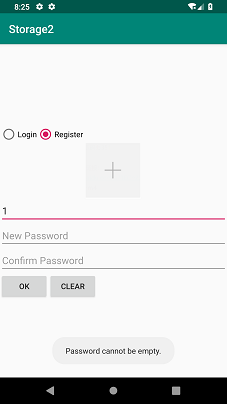

# 中山大学数据科学与计算机学院本科生实验报告
## （2018年秋季学期）
| 课程名称 | 手机平台应用开发 | 任课老师 | 郑贵锋 |
| :------------: | :-------------: | :------------: | :-------------: |
| 年级 | 2016 | 专业（方向） | 软件工程电子政务方向 |
| 学号 | 16340301 | 姓名 | 赵俊祥 |
| 电话 | 15920804547 | Email | 1773133512@qq.com |
| 开始日期 | 11.9 | 完成日期 |11.19|

---

## 一、实验题目 数据存储应用开发

---

## 二、实现内容

### 第九周

1. 密码输入Activity

- 若应用首次启动，则界面呈现出两个输入框，分别为新密码输入框和确认密码输入框。
- 输入框下方有两个按钮： 
  - OK按钮击后：
    - 若New Password为空，则发出Toast提示。见Figure 3。
    - 若New Password与Confirm Password不匹配，则发出Toast提示，见Figure 2。
    - 若两密码匹配，则保存此密码，并进入文件编辑Activity。 
  - CLEAR按钮点击后：清楚两输入框的内容。
- 完成创建密码后，退出应用再进入应用，则只呈现一个密码输入框 
  - 点击OK按钮后，若输入的密码与之前的密码不匹配，则弹出Toast提示，见Figure 5。
  - 点击CLEAR按钮后，清除密码输入框的内容。

2. 文件编辑Activity

- 界面底部有三个按钮，高度一致，顶对齐，按钮水平均匀分布，三个按钮上方除ActionBar和StatusBar之外的全部空间由一个EditText占据（保留margin）。EditText内的文字竖直方向置顶，左对齐。
- 在编辑区域输入任意内容，点击SAVE按钮后能保存到指定文件（文件名随意）。成功保存后，弹出Toast提示，见Figure 8。
- 点击CLEAR按钮，能清空编辑区域的内容。
- 点击LOAD按钮，能够从同一文件导入内容，并显示到编辑框中。若成功导入，则弹出Toast提示。见Figure 7.若读取文件过程中出现异常（如文件不存在），则弹出Toast提示

3. 特殊要求：进入文件编辑Activity后，若点击返回按钮，则直接返回Home界面，不再返回密码输入Activity。
### 第十一周

- 技术要求：
  - 使用SQLite数据库保存用户的相关信息和评论的相关信息，使得每次运行程序都可以使用数据库进行用户的登陆与注册，以及显示数据库中的评论；
  - 使用ContentProvider来获取对应用户的电话号码；
- 功能要求
  - 首页Activity包含登录功能和注册功能，通过radioButton在两个页面进行切换,在登陆界面输入正确的用户名和密码后跳转到评论页面。
  - 评论Activity,界面由ListView、EditText和Button组成，ListView中展示数据库中保存的评论信息，在EditText写评论，点击Send按钮发送评论。
  - 首页Activity：
    - 应用启动时，界面初始化为登录界面，通过Login和Register两个RadioButton进行登录与注册之间的切换。
    - 点击Login切换到登录界面（见图1.1），可以保留注册界面时的Username，但不保存密码。
    - 点击Register切换到注册页面（见图2.1），可以保留登录界面时的Username，但不保存密码，在输入框和RadioButto之间存在一个头像ImageView，水平居中。
  - 评论页面： 
    - 界面底部有一个EditText和一个按钮，高度一致，EditText占据按钮左边的全部空间。上方的全部剩余空间由一个ListView占据（保留margin）。见图3.1.
    - ListView中的每条Item，包含了头像、点赞按钮这两个ImageView和用户名、评论时间、评论内容、点赞数这4个TextView。
    - 点击EditText写评论
    - 点击Send按钮发送评论
    - ListView中的Item点击事件
- 附加功能
  - 可以从手机图库选择用户头像
  - 点赞功能：点赞状态的保存和点赞数的保存。

---

## 三、实验结果
### (1)实验截图
#### 第九周
- 启动应用后显示两个输入框，当输入框为空时点击OK按钮弹出消息“Password cannot be empty.”

   

- 点两个密码不一致时点击OK按钮，弹出消息“Password mismatch.”；点击CLEAR按钮，清空两个输入框。

   

- 输入两个相同的密码，可以成功进入编辑界面。

   

- 当未创建文件时，点击LOAD按钮，提示“Fail to load file.” 输入一段文字，点击SAVE按钮，提示"Save successfully."

    

- 点击CLEAR按钮，清空编辑框内容。再次点击LOAD按钮，这次可以成功加载，提示“Load successfully.”且编辑框内容变为上次保存的内容。

   

- 点击返回按钮退回Home界面。再次启动应用，界面中只有一个输入框。

  

- 输入错误的密码，弹出消息“Invalid password.”； 输入正确的密码则进入编辑界面。

  
#### 第十一周

- 点击Login切换到登陆界面，若Username为空，则发出Toast提示“Username cannot be empty.”

   

- 若password为空，则发出提示“Password cannot be empty.”；若username不存在，则提示“Username not existed.”

   

- 若密码不正确，则发出Toast提示“Invalid password.''；点击register切换到注册界面。

   

- 若username为空，发出提示“Username cannot be empty.”；若NewPassword为空，则发出提示。

   

- 若密码不匹配，则弹出“Password mismatch.”；若用户已存在，则弹出“Username already existed.”

   

- 成功登陆后进入评论界面；若EditText为空，提示“Comment cannot be empty.”

   

- 短按评论，弹出对话框，显示用户名及其通讯录中的号码。

   

- 长按评论，如果是自己的评论，弹出“是否删除”的对话框；否则弹出“是否举报”的对话框。

   

- 注册时进入手机图库选择头像。

   

- 正确显示点赞按钮的颜色和点赞数。

   


### (2)实验步骤以及关键代码

#### 第九周

- 首先实现密码界面的布局，在xml文件中加入两个EditText和两个Button，使用约束布局控制各个控件的位置。EditText的width设置为“match_parent”使其占满整个界面。

- 在mainActivity，即密码界面的activity中，用findViewById获取到两个按钮，分别添加OnClickListener处理点击事件。在Clear按钮的监听器中，用setText("")清空两个编辑框。在OK按钮的监听器中，判断两个字符串的关系，弹出不同的信息提示。

  ````java
  //设置监听器
  Button okButton = (Button)findViewById(R.id.okBtn);
  Button clearButton = (Button)findViewById(R.id.clearBtn);
  okButton.setOnClickListener(new View.OnClickListener()
  clearButton.setOnClickListener(new View.OnClickListener()
  //清空输入
  newPassword.setText("");
  confirmPassword.setText("");
  ````

- 保存密码并跳转至编辑界面。当两个输入框的输入相同且不空时,使用getSharedPreferences获取到应用的sharedpreference，然后定义一个Editor对sharedpreference进行修改。修改完成后，调用commit函数提交修改。最后用intent跳转到EditActivity。

  ````java
  //保存密码
  SharedPreferences myPreference = getSharedPreferences("MY_PREFERENCE",MODE_PRIVATE);
  SharedPreferences.Editor editor = myPreference.edit();
  editor.putString("password", newPassword.getText().toString());
  editor.commit();
  //跳转
  Intent intent = new Intent(MainActivity.this, EditActivity.class);
  startActivity(intent);
  ````

- 实现再次启动应用时只显示一个输入框。在MainActivity的onCreate函数中，先获取到sharedPreferences，用getString方法获取“password”的值，并传入一个默认返回值“default”。如果返回值等于“default”，说明没有保存过密码，主界面显示两个输入框，无需特殊处理。如果返回值不等于“default”，说明已经创建了密码，此时把第一个输入框的hint修改为“Password”，把第二个输入框用setVisibility设置为不可见。

  ```java
  SharedPreferences myPreference = getSharedPreferences("MY_PREFERENCE",MODE_PRIVATE);
  password = myPreference.getString("password", "default");
  
  if(!password.equals("default")){
      newPassword.setHint("Password");
      confirmPassword.setVisibility(View.GONE);
  }
  ```

- 严重密码正确性。在OK按钮的处理函数加入条件判断password是否为“default”，如果不是，则要将密码框的字符串与password进行比较，相同时才调用startActivity进行跳转，否则弹出“Invalid password.”

  ````java
  if(newPassword.getText().toString().equals(password)){
      Intent intent = new Intent(MainActivity.this, EditActivity.class);
      startActivity(intent);
  }else{
      Toast.makeText(getApplicationContext(),"Invalid Password", Toast.LENGTH_SHORT).show();
  }
  ````

- 实现编辑界面的布局。使用LinearLayout，里面放置一个EditText和另一个LinearLayout，把EditText的weight设置为1，LinearLayout的weight默认为0，这样EditText就可以占满界面的所有剩余空间。把EditText的gravity设置为"top|left"，光标才能定位到左上角。在内层的LinearLayout中放置三个Button，orientation设置为Horizontal，然后weight全部设置为1，使其均匀分布。最后调整margin使布局达到实验要求。

  ````xml
  <EditText
      android:inputType="textMultiLine|textNoSuggestions"
      android:gravity="top|left"
      android:layout_weight="1"/>
  
  <LinearLayout>
      <Button
          android:layout_weight="1"
          android:text="SAVE"/>
      <Button
          android:layout_weight="1"
          android:text="LOAD"/>
      <Button
          android:layout_weight="1"
          android:text="CLEAR"/>
  </LinearLayout>
  ````

  

- 保存文件功能。在SAVE按钮的监听函数中，使用FileOutputStream进行文件的写入。使用openFileOutput函数打开文件输出流，用write函数把EditText的内容写入文件，然后调用flush函数确保把缓冲区中的内容写入文件，最后close函数关闭文件。

  ````java
  try (FileOutputStream fileOutputStream = openFileOutput(FILE_NAME, MODE_PRIVATE)) {
      String str = editText.getText().toString();
      fileOutputStream.write(str.getBytes());
      fileOutputStream.flush();
      fileOutputStream.close();
      Log.i("TAG", "Successfully saved file.");
      Toast.makeText(getApplicationContext(), "Save successfully.", Toast.LENGTH_SHORT).show();
  } catch (IOException ex) {
      Log.e("TAG", "Fail to save file.");
  }
  ````

- 加载文件功能。在LOAD按钮的监听函数中，使用FileInputStream进行文件的读取。定义一个byte数组用于存储文件内容。FileInputStream 的read函数每次读取一个字节，返回值是下一个字节，如果到达文件尾会返回-1，因此用read函数的返回值作为while循环的判断条件，把读取到的每个字节放入StringBuilder中，最后再转成String赋值给EditText。

  ````java
  try (FileInputStream fileInputStream = openFileInput(FILE_NAME)) {
      byte[] contents = new byte[fileInputStream.available()];
      StringBuilder stringBuilder = new StringBuilder("");
      int len = 0;
      while((len = fileInputStream.read(contents)) > 0){
          stringBuilder.append(new String(contents,0,len));
      }
      fileInputStream.close();
      editText.setText(stringBuilder.toString());
      Toast.makeText(getApplicationContext(), "Load successfully.", Toast.LENGTH_SHORT).show();
  }
  ````

- 为了使得点击返回按钮直接退回Home界面，需要在AndroidManifest.xml中，把mainActivity的noHistory属性置为true。

  ```xml
   <activity android:name=".MainActivity" android:noHistory="true">
  ```


#### 第十一周

- 实现登陆注册界面。在activity_main.xml中，添加RadioGroup、EditText、ImageView和Button等控件，借助约束布局实现控件之间的位置关系。在MainActivity中，获取到Login的RadioButton，设置checked为true，默认选中登陆界面，同时把comfirm Password的输入框和头像的ImageView设置为不可见，并保存一个isLogin变量，置为true。

  ````java
  //启动应用，默认为登陆状态
  RadioButton loginBtn = (RadioButton)findViewById(R.id.loginBtn);
  loginBtn.setChecked(true);
  EditText newPassword = (EditText)findViewById(R.id.newPassword);
  EditText comfirmPassword = (EditText)findViewById(R.id.comfirmPassword);
  ImageView add = (ImageView)findViewById(R.id.add);
  add.setVisibility(View.GONE);
  comfirmPassword.setVisibility(View.GONE);
  ````

- 切换按钮显示不同的界面。获取到RadioGroup，添加监听器，当触发切换事件时，判断isLogin的值，如果为真，则把comfirm password的输入框和头像设置为可见，修改对应的提示词，把isLogin置为false；否则隐藏comfirm Password的输入框和头像的ImageView，把isLogin置为true。

  ````java
  if(isLogin){
      comfirmPassword.setVisibility(View.VISIBLE);
      add.setVisibility(View.VISIBLE);
      isLogin = false;
  }else{
      comfirmPassword.setVisibility(View.GONE);
      add.setVisibility(View.GONE);
      isLogin = true;
  }
  ````

- 实现注册功能。给OK按钮添加监听事件，判断username和password的情况，决定弹出不同的toast信息。当用户名不空且密码匹配时，需要进行数据库操作。因此，首先需要创建数据库。新建myDB类，在onCreate函数中创建表格USER保存用户信息，以用户名作为主键。然后实现insertUser函数来插入用户信息。在insertUser中，用getWritableDatabase()获取到数据库，新建一个Contentvalues来保存要插入的新数据，使用键值对的形式插入数据。用户头像的保存需要先获取到imageView的bitmap，然后转换成Byte数组进行保存。最后调用db的insert函数并关闭数据库。为了判断用户名是否重复，需要实现一个查询用户的函数，用getReadableDatabase()获取到数据库，定义一个selection字符串来表示选择的条件，定义一个selectionArgs的数组存储选择条件中的参数。然后调用query函数，返回值赋给Cursor，返回Cursor.moveToFirst（），非空则说明用户已存在。

  ````java
  //创建USER表格
  String CREATE_USER_TABLE = "CREATE TABLE if not exists " + USER_TABLE_NAME + " (username STRING PRIMARY KEY, password STRING, photo BLOB)";
  sqLiteDatabase.execSQL(CREATE_USER_TABLE);
  //插入用户
  SQLiteDatabase db = getWritableDatabase();
  ContentValues values = new ContentValues();
  values.put("username", user.getUsername());
  values.put("password", user.getPassword());
  long rid = db.insert(USER_TABLE_NAME, null,values);
  db.close();
  //查询用户
  SQLiteDatabase db = getReadableDatabase();
  String selection = "username = ?";
  String[] selectionArgs = {username};
  Cursor cursor = db.query(USER_TABLE_NAME, null, selection, selectionArgs,null,null,null);
  return cursor.moveToFirst();
  ````

- 实现登陆功能。当username和password不空时，调用db的查询用户函数，判断用户是否存在，不存在则弹出提示信息。如果存在，则要判断密码是否正确。在myDB中实现getPassword函数，与EditText中的password进行比较，相同时才进行跳转。页面跳转功能用intent和startAcitivity实现，需要把username放进intent中传递到评论界面。

  ````java
  else if(!db.getByUsername(username.getText().toString())){
      Toast.makeText(getApplicationContext(),"Username not existed.",Toast.LENGTH_SHORT).show();
  }
  else if(!db.getPassword(username.getText().toString()).equals(newPassword.getText().toString())){
      Toast.makeText(getApplicationContext(),"Invalid password.",Toast.LENGTH_SHORT).show();
  }
  else{
      Intent intent = new Intent(MainActivity.this, CommentActivity.class);
      Bundle bundle = new Bundle();
      bundle.putString("username", username.getText().toString());
      intent.putExtras(bundle);
      startActivity(intent);
  }
  ````

- 实现评论界面。评论界面使用ListView来实现。首先创建一个item.xml，定义好每条评论的格式。然后新建一个CommentInfo类，把每条评论的信息封装成一个类。再创建一个Adapter类，定义ListView的适配器。在Adapter中，保存一个CommentInfo类的list，然后重写getView函数，从viewHolder中取出对应的对象并对其进行赋值。在CommentActivity中，同样定义一个CommentInfo类的list，用于保存所有评论，在onCreate函数中调用数据库地queryComment函数，查询到所有评论并赋值给list。然获取到listview，给listview设置Adapter。每次list有任何改变时，就调用Adapter的refresh函数进行更新。

  ````java
  final Adapter myAdapter = new Adapter(CommentActivity.this, list, username, db);
  final ListView listView = (ListView)findViewById(R.id.listView);
  listView.setAdapter(myAdapter);
  ````

- 插入评论。首先在myDB中，创建保存评论的表格。每条评论有id、用户名、评论内容、时间、点赞数和用户头像等信息。然后实现insertComment函数，方法与插入用户类似。然后再send按钮的监听函数中，调用系统的Date函数获取到当前时间，用SimpleDateFormat设置时间的格式。获取到username，comment等信息后，创建一个临时的CommentInfo对象，插入list中并调用适配器的refresh函数，再插入数据库。

  ````java
  //创建Comment表格
  String CREATE_COMMENT_TABLE = "CREATE TABLE if not exists " + COMMENT_TABLE_NAME +" (id INTEGER PRIMARY KEY AUTOINCREMENT, username STRING, time STRING, comment STRING, likeCount INTEGER, photo BLOB)";
  sqLiteDatabase.execSQL(CREATE_COMMENT_TABLE);   
  //发送评论
  SimpleDateFormat dateFormat = new SimpleDateFormat("yyyy-MM-dd HH:mm:ss");
  String time = dateFormat.format(new Date());
  CommentInfo newComment = new CommentInfo(username,time,comment.getText().toString(),0, photo);
  newComment.setId(db.insertComment(newComment));
  list.add(newComment);
  myAdapter.refresh(list);
  comment.setText("");
  ````

- 评论单击事件。给listviwe添加OnItemClickListener，使用getContentResolver的query函数进行查询，参数为ContactsContract.CommonDataKinds.Phone.CONTENT_URI，代表通讯录中的手机号码。查询完后，调用cursor的moveToFirst，判断为非空后再进行读取。最后用AlertDialog弹出信息。

  ````java
  //读取通讯录
  Cursor cursor = getContentResolver().query(ContactsContract.CommonDataKinds.Phone.CONTENT_URI,null,ContactsContract.CommonDataKinds.Phone.DISPLAY_NAME + " = \"" +  commentUser + "\"", null, null);                      
  String number = "\nPhone: ";
  if(cursor.moveToFirst()){
      do {
          number += cursor.getString(cursor.getColumnIndex(ContactsContract.CommonDataKinds.Phone.NUMBER)) + "         ";
      } while (cursor.moveToNext());
  }
  else{
      number = "\nPhone number not exist.";
  }
  ````

- 长按功能。给listviwe添加OnItemLongClickListener，实现判断点击的评论的username与当前username是否一致，如果不一致，弹出是否举报的信息；如果一致，调用数据库的deleteComment函数和list的remove函数，最后调用适配器的refresh函数。

  ````java
  //删除评论
  long id = list.get(position).getId();
  if(db.deleteComment(id) == 1){
      Toast.makeText(getApplicationContext(),"Delete successfully.", Toast.LENGTH_SHORT).show();
  }
  list.remove(position);
  myAdapter.refresh(list);
  ````

- 本地选择图片功能。新建一个intent，把Action设置为Intent.ACTION_PICK，类型设置为image/*，代表选择图片，然后startActivityForResult。最后重写onActivityResult函数，用getData函数获取到uri，然后转化成bitmap，设置到imageview中即可。但是为了避免OOM，需要先将图片进行压缩后再转换成bitmap。我自定义了一个getBitmapFormUri函数，在getBitmapFormUri中进行图片的大小压缩和质量压缩，使用到了BitmapFactory.Options，具体代码如下。

  ````java
  //进入图库
  Intent intent = new Intent();
  intent.setAction(Intent.ACTION_PICK);
  intent.setType("image/*");
  startActivityForResult(intent,0);
  //读取
  Uri uri = data.getData();
  ImageView add = (ImageView)findViewById(R.id.add);
  try {
      photo =  getBitmapFormUri(MainActivity.this,uri);
      add.setImageBitmap(photo);
  }catch (Exception e){}
  //压缩
  public static Bitmap getBitmapFormUri(Activity ac, Uri uri) throws FileNotFoundException, IOException {
      InputStream input = ac.getContentResolver().openInputStream(uri);
      BitmapFactory.Options onlyBoundsOptions = new BitmapFactory.Options();
      onlyBoundsOptions.inJustDecodeBounds = true;
      onlyBoundsOptions.inDither = true;//optional
      onlyBoundsOptions.inPreferredConfig = Bitmap.Config.ARGB_8888;//optional
      BitmapFactory.decodeStream(input, null, onlyBoundsOptions);
      input.close();
      int originalWidth = onlyBoundsOptions.outWidth;
      int originalHeight = onlyBoundsOptions.outHeight;
      if ((originalWidth == -1) || (originalHeight == -1))
          return null;
      float hh = 800f;
      float ww = 480f;
      int be = 1;
      if (originalWidth > originalHeight && originalWidth > ww) {
          be = (int) (originalWidth / ww);
      } else if (originalWidth < originalHeight && originalHeight > hh) {
          be = (int) (originalHeight / hh);
      }
      if (be <= 0)
          be = 1;
      BitmapFactory.Options bitmapOptions = new BitmapFactory.Options();
      bitmapOptions.inSampleSize = be;//设置缩放比例
      bitmapOptions.inDither = true;//optional
      bitmapOptions.inPreferredConfig = Bitmap.Config.ARGB_8888;//optional
      input = ac.getContentResolver().openInputStream(uri);
      Bitmap bitmap = BitmapFactory.decodeStream(input, null, bitmapOptions);
      input.close();
  
      return compressImage(bitmap);//再进行质量压缩
  }
  public static Bitmap compressImage(Bitmap image) {
  
      ByteArrayOutputStream baos = new ByteArrayOutputStream();
      image.compress(Bitmap.CompressFormat.JPEG, 100, baos);
      int options = 100;
      while (baos.toByteArray().length / 1024 > 100) {  
          baos.reset();
          image.compress(Bitmap.CompressFormat.JPEG, options, baos);
          options -= 10;
      }
      ByteArrayInputStream isBm = new ByteArrayInputStream(baos.toByteArray());
      Bitmap bitmap = BitmapFactory.decodeStream(isBm, null, null);
      return bitmap;
  }
  ````

- 实现点赞按钮状态记录和点赞数的保存。为了保存哪个用户给哪个评论点过赞，我在数据库中创建了一个LIKE_TABLE来记录用户与评论间的点赞关系，LIKE表格有id、username和commentId三个属性，唯一地记录了点赞关系。然后实现insertLike，deleteLike和isLiked三个函数来插入、删除、和查询点赞关系。接着，需要在Adapter中，调用isLiked函数，判断当前的评论是否被当前用户评论过，如果结果为真，就把按钮设为红色，并setTag为“like”，否则设为白色，setTag为“Dislike”。在点赞按钮的监听器中，判断控件的tag，如果为like，则把点赞数减一，tag设置为dislike，反之同理。

  ````java
  //创建LIKE_TABLE
  String CREATE_LIKE_TABLE = "CREATE TABLE if not exists " + LIKE_TABLE_NAME+
      " (id INTEGER PRIMARY KEY AUTOINCREMENT, username STRING, commentId STRING)";
  sqLiteDatabase.execSQL(CREATE_LIKE_TABLE);
  //操作函数
  public long insertLike(String username, long commentId);
  public int deleteLike(String username, long commentId);
  Boolean isLiked(String username, long commentId);
  //初始化点赞按钮的颜色
  if(db.isLiked(username, list.get(i).getId())){
      viewHolder.likeBtn.setImageResource(R.mipmap.red);
      viewHolder.likeBtn.setTag("like");
  }else{
      viewHolder.likeBtn.setImageResource(R.mipmap.white);
      viewHolder.likeBtn.setTag("dislike");
  }
  ````

  


### (3)实验遇到的困难以及解决思路
#### 第九周
- 一开始时密码输入框的横线无法填满整个界面，于是把width设置为0dp，因为项目一就是这样实现的。但是发现没有效果，原因是项目一的EditText右边还有一个按钮，所以设置width为0dp后，横线会填满EditText与按钮之间的空白，但是这次实验的EditText右边并没有其他控件。正确的做法是width设置为“match-parent”，与父容器一致，则可以占满。
- 创建好密码后，重新启动应用要更改界面的布局，只显示一个输入框。解决的思路是每次调用mainActivity的onCreate函数时，先读取sharedPreferences的内容，在getString函数中传入一个默认返回值“default”，如果返回结果仍然是“default”，则说明没有创建过密码；如果不再是“default”，则把第二个输入框设置为不可见。
- 编辑框随便输入一些内容时，会在文字下出现一条红线，解决的方法是把EditText的inputType设置为"textNoSuggestions"。
- 设置编辑界面的布局时，采用了线性布局的weight使EditText占满上方所有剩余空间，但不知道如何使下方的三个按钮均匀分布。看了一些网上的方法后，把三个按钮的weight都设置为1，实现了均匀分布，但是按钮会被拉伸到占满空间。最终只能修改Button的margin，使得按钮不会出现拉伸的情况。
- 进行文件的写入或读取时，出现了异常。于是按照教程，用try和catch进行异常处理，方便debug。
- 进行文件读取时，一开始不明白read函数的用法。查阅资料后才明白，read函数一次读取一个字节，返回值是下一个字节的标号，读取到文件尾的时候返回-1，所以可以使用read的返回值作为while的判断条件。
#### 第十一周

- 单击评论时，出现了程序退出的情况，原因在于没有给应用访问通讯录的权限。打开权限后便不再出现问题。
- 存储用户的头像时，有两种方法，一开始考虑了存储图片的路径，但是这样处理如果外部图片被删除，头像就无法正确加载出来了。因此最后选择直接存储图片，把读取的图片转成bitmap，再转成byte数组存进数据库中。
- 当图片太大时，会出现OOM的情况，解决方法是通过uri生成bitmap时先进行压缩。
- 存储评论时，每条评论的id是自动生成的，所以新建的commentInfo对象是没有id的，这是长按删除时无法正确删除，因为没有正确的id。解决方法是调用insertComment函数后要把返回值（即id）赋值给新建commentInfo后再添加到list中。
- 进行数据库查询时，经常出现程序崩溃的情况，原因在于没有先判断cursor.moveToFirst是否为空就调用了get函数，导致使用了空引用。解决方法是加入if（cursor.moveToFirst）的判断。
- 为了正确显示点赞按钮的颜色，需要记录哪些用户给哪些评论点了赞。一开始的想法是在用户信息中保存一个list，记录点过赞的评论的id，但是由于数据库存储没法直接存储list类型，需要把list中的所有项都存进一个字符串中，用一个分隔符分开，读取时再一个个获取，略显麻烦。所以我新建了一个LIKE_TABLE 保存了用户和评论间的点赞关系，关系表的每一项保存了一个用户名和一个评论id，通过查询该表来判断是否有点赞关系。

---

## 四、实验思考及感想

简要描述Internal Storage和External Storage的区别，以及它们的适用场景。

- Internal Storage把数据存储在设备的内部存储器上，只允许应用程序本身访问，应用删除后就随着删除。适用于保存数据量较少，或比较隐私的信息。
- External Storage把数据存储在SD卡上，手机的文件浏览器也可以访问。适用于保存大尺寸的文件或者是一些无需设置访问权限的文件，例如录制的视频文件和音频文件。

第九周实验使用SharedPreferences和内部存储实现了简单的数据存储功能。sharedPreferences使用键值对来存储数据，与关系数据库相比，可存储的数据量比较有限。使用sharedpreferences时，可以通过Android Studio的File Explorer来查看sharePreferences是否创建成功，帮助排查问题。文件的存储和加载功能选择了内部存储的方式，即数据存储在应用内部文件夹中，不访问手机的sd卡。实现过程没有遇到太多问题，主要把FileInputStream的read函数的参数和返回值弄清楚就可以了。除了逻辑功能外，界面的实现涉及了LinearLayout的使用，但其实用约束布局同样可以实现实验要求的效果。总体来说，这次实验还是挺容易的，遇到的问题都比较好解决。

第十一周的实验使用了SQLite进行数据库存储。数据库的操作最重要的就是细心，传递的参数如果写错了，或者搞错了顺序，debug起来真的很难找。例如在实现点赞数量的存储时，在updateComment函数设置了断点进行调试，看到传进来的参数没错，但是执行完后结果就是不对。最后才发现是db.update函数的whereArgs写错了，把id写成了likeCount点赞数。所以下载一个数据库可视化工具是很有必要的，例如用sqliteExpert可以看到数据库中每个表格的更新情况，执行每个语句后的结果都可以看到，很大程度上可以提高debug的效率。除此之外，本周实验的应用运行时经常可以看到日志中出现类似 “线程正在处理过多任务” 的内容，尤其是选择手机图库图片时，因此应该对选取的图片进行压缩处理，减少应用的负担。

---

