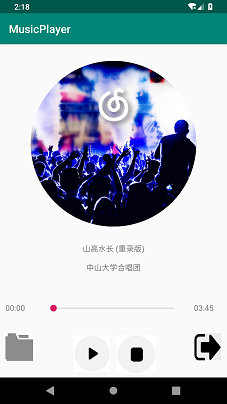
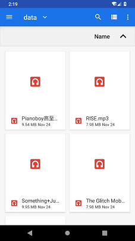

# 中山大学数据科学与计算机学院本科生实验报告
## （2018年秋季学期）
| 课程名称 | 手机平台应用开发 | 任课老师 | 郑贵锋 |
| :------------: | :-------------: | :------------: | :-------------: |
| 年级 | 2016级 | 专业（方向） | 软件工程（电子政务） |
| 学号 | 16340301 | 姓名 | 赵俊祥 |
| 电话 | 15920804547 | Email | 1773133512@qq.com |
| 开始日期 | 11.22 | 完成日期 |12.6|

---

## 一、实验题目 简单音乐播放器

---

## 二、实现内容

- 播放、暂停、停止、退出功能，按停止键会重置封面转角，进度条和播放按钮；按退出键将停止播放并退出程序

- 后台播放功能，按手机的返回键和home键都不会停止播放，而是转入后台进行播放

- 进度条显示播放进度、拖动进度条改变进度功能

- 播放时图片旋转，显示当前播放时间功能，圆形图片的实现使用的是一个开源控件CircleImageView

- 附加内容：选歌

  用户可以点击选歌按钮自己选择歌曲进行播放，要求换歌后不仅能正常实现上述的全部功能，还要求选歌成功后不自动播放，重置播放按钮，重置进度条，重置歌曲封面转动角度，最重要的一点：需要解析mp3文件，并更新封面图片。

---

## 三、课堂实验结果
### (1)实验截图

- 开始界面，显示加载的音乐的封面，歌名和歌手；点播放按钮开始播放，开始按钮变成暂停按钮，封面开始旋转。

   

- 点击暂停按钮停止播放，暂停按钮变为播放按钮，封面停止旋转；点击停止按钮，进度回到原点，封面也置为初始状态。

  

- 点击文件选择按钮，选择本地音频文件，添加后，封面和歌曲信息都对应发生改变。

  

### (2)实验步骤以及关键代码
#### 使用handler的版本

- 实现界面布局。本次实验使用了我们小组期中项目实现的CircleImage的代码，没有引用教程里的库。首先，为了实现圆形封面，需要自定义一个CircleImageView类，该类继承了ImageView，使用canvas将ImageView修改为圆形。在activity_main.xml中，添加一个CircleImageView代表封面，再加入歌名、歌手等textView，加入SeekBar实现进度条，添加四个按钮。

  ````xml
  <com.example.musicplayer.CircleImageView
          android:layout_width="300dp"
          android:layout_height="300dp"
          app:layout_constraintLeft_toLeftOf="parent"
          app:layout_constraintRight_toRightOf="parent"
          app:layout_constraintTop_toTopOf="parent"
          android:layout_marginTop="30dp"
          android:id="@+id/cover"/>
  ````

- 实现MusicService类。首先实现MusicService的构造函数，创建一个MediaPlayer，用setDataSource设置播放的音频文件，然后调用prepare函数进入就绪状态。然后实现播放、暂停和停止功能。播放和暂停功能为一个函数，先用isPlaying判断是否在播放，如果是，则用pause()暂停播放，否则调用start()继续播放。停止函数先调用stop函数停止播放，然后用seekTo(0)将进度跳回原点。

  ````java
  public MusicService(){
      mediaPlayer = new MediaPlayer();
      try {
          mediaPlayer.setDataSource("/sdcard/data/山高水长.mp3");
          mediaPlayer.prepare();
      }catch (IOException e){
          e.printStackTrace();
      }
  }
  public void playOrPause(){
      if(mediaPlayer != null){
          if(mediaPlayer.isPlaying()){
              mediaPlayer.pause();
          }else {
              mediaPlayer.start();
          }
      }
  }
  public void stop(){
      if(mediaPlayer != null){
          mediaPlayer.stop();
          try {
              mediaPlayer.prepare();
              mediaPlayer.seekTo(0);
          } catch (IOException e) {
              e.printStackTrace();
          }
      }
  }
  ````

- 通过Binder实现Activity和Service的通信。实现getService方法，返回MusicService类的实例。

  ````java
   public MyBinder binder = new MyBinder();
   public class MyBinder extends Binder {
   	MusicService getService() {
   		return MusicService.this;
   	}
   }
  ````

- 在Activity中调用bindService，绑定成功后会调用onServiceConnected函数，因此在onServiceConnected中解析歌曲信息并初始化界面。首先用SimpleDataFormat定义时间的格式，然后用format函数将mediaPlayer.getCurrentPosition()的毫秒数转换成mm:ss的格式，添加到界面上。然后解析歌曲信息，在这里我实现了一个extractMusicData函数，在这个函数中，使用MediaMetadataRetriever来获取歌曲信息，设置参数为METADATA_KEY_TITLE和METADATA_KEY_ARTIST分别获取歌名和歌手，封面的解析需要借助byte数组转换为bitmap。最后，为了使得歌曲播放完成后封面停止，需要给mediaplayer添加监听器，在setOnCompletionListener中停止旋转动画。

  ````java
  //绑定service与activity
  Intent intent = new Intent(MainActivity.this, MusicService.class);
  bindService(intent, sc, BIND_AUTO_CREATE);
  //初始化
  currentPos.setText(timeFamate.format(musicService.mediaPlayer.getCurrentPosition()));
  totalLen.setText(timeFamate.format(musicService.mediaPlayer.getDuration()));
  extractMusicData();
  musicService.mediaPlayer.setOnCompletionListener(new MediaPlayer.OnCompletionListener() {
      @Override
      public void onCompletion(MediaPlayer mp) {
          animator.pause();
  		...
      }
  });
  //解析歌曲信息
  private void extractMusicData(){
      MediaMetadataRetriever mediaMetadataRetriever = new MediaMetadataRetriever();
      mediaMetadataRetriever.setDataSource(musicPath);
      //获取歌名和歌手
    musicName.setText(mediaMetadataRetriever.extractMetadata(MediaMetadataRetriever.METADATA_KEY_TITLE));
    artist.setText(mediaMetadataRetriever.extractMetadata(MediaMetadataRetriever.METADATA_KEY_ARTIST));
      //获取专辑图片
      byte[] bytes = mediaMetadataRetriever.getEmbeddedPicture();
      Bitmap bitmap = BitmapFactory.decodeByteArray(bytes, 0,bytes.length);
      cover.setImageBitmap(bitmap);
  }
  ````

- 实现旋转动画。定义一个ObjectAnimator，用ofFloat函数设置动画类型为rotation，然后设置时间等信息。

  ````java
  animator = ObjectAnimator.ofFloat(cover, "rotation",0f, 360f);
  animator.setDuration(20000);
  animator.setInterpolator(new LinearInterpolator());
  animator.setRepeatCount(ValueAnimator.INFINITE);
  ````

- 实现进度更新。定义一个Handler，使用post函数更新UI。重写Runnable的run函数，将mediaplayer的CurrentPosition赋给SeekBar的progress，同时更新时间的textview。

  ````java
  seekBar.setProgress(musicService.mediaPlayer.getCurrentPosition());
  seekBar.setMax(musicService.mediaPlayer.getDuration());
  currentPos.setText(timeFamate.format(musicService.mediaPlayer.getCurrentPosition()));
  totalLen.setText(timeFamate.format(musicService.mediaPlayer.getDuration()));
  mHandler.postDelayed(mRunnable, 100);
  ````

- 返回按钮。解除service的绑定，调用activity的finish函数。

  ````java
  mHandler.removeCallbacks(mRunnable);
  unbindService(sc);
  try {
  	MainActivity.this.finish();
  	System.exit(0);
  } catch (Exception e) {
  	e.printStackTrace();
  }
  ````

- 本地选择音频文件。给fileBtn添加监听器，使用intent和startActivityForResult来选择文件。设置intent的action为ACTION_GET_CONTENT，类型为audio。在onActivityResult中，获取到uri，然后通过uri获取到文件真正的物理路径（ 该步骤引用了网上的代码）。获取到路径后，将mediaPlayer重置，即reset()。然后重新setDataResource，调用前面的extractMusicData函数解析歌曲信息。

  ````java
  //启动activity
  Intent intent = new Intent();
  intent.setAction(Intent.ACTION_GET_CONTENT);
  intent.setType("audio/*");
  startActivityForResult(intent,0);
  //处理uri
  protected void onActivityResult(int requestCode, int resultCode, Intent data){
      if(data != null){
          Uri uri = data.getData();
          musicPath = getPath(MainActivity.this,uri);
          try {
              reset();
              musicService.mediaPlayer.setDataSource(musicPath);
              musicService.mediaPlayer.prepare();
              extractMusicData();
          }catch (Exception e){
              e.printStackTrace();
          }
      }
  }
  ````

#### 使用transact和Rxjava的版本

- 在MyBinder中重写onTransact函数，根据不同的操作码，执行不同的操作。开始、暂停或者停止的操作与前面的版本一致。为了获取到音频的总时长和当前播放位置，可以用writeInt函数把时间写进reply中，然后返回。在MainActivity中，使用readInt函数从reply中读出数据。

  ````java
  //Service的功能
  case TOTAL_TIME:
  	reply.writeInt(mediaPlayer.getDuration());
  	break;
  case CUR_POS:
  	reply.writeInt(mediaPlayer.getCurrentPosition());
  	break;
  case ADD_CODE:
  	mediaPlayer.reset();
  	try {
      	mediaPlayer.setDataSource(data.readString());
      	mediaPlayer.prepare();
  	}catch (IOException e){
     	 e.printStackTrace();
  	}
  	break;
  //读取数据
  Parcel data = Parcel.obtain();
  Parcel reply = Parcel.obtain();
  try {
      mBinder.transact(TOTAL_TIME,data,reply,0);
  }catch (RemoteException e){
      e.printStackTrace();
  }
  totaltime = reply.readInt();
  ````

- 实现播放、暂停和停止按钮功能。在按钮的监听器中，调用mBinder的transact函数，用不同的操作码指定service进行的操作。对于进度条，需要把进度条的位置传递给transact，所以需要在用writeInt把进度条的位置写入data中，然后作为参数传递进去。在Service中，使用readInt从data中读取出数据，然后用seekTo函数更新MediaPlayer的进度。

  ````java
  //play button
  Parcel data = Parcel.obtain();
  Parcel reply = Parcel.obtain();
  try{
  	mBinder.transact(PLAY_CODE,data,reply,0);
  }catch (RemoteException e){
  	e.printStackTrace();
  }
  //seekBar
  Parcel data = Parcel.obtain();
  Parcel reply = Parcel.obtain();
  data.writeInt(progress);
  try {
      mBinder.transact(SEEK_BAR,data,reply,0);
  }catch (RemoteException e){
      e.printStackTrace();
  }
  ````

- 使用Rxjava实现异步更新UI。首先创建一个被观察者observable，重写subscribe函数，在函数中使用一个while循环，用mBinder.transact(CUR_POS,data,reply,0)不停地查询当前播放的位置，然后通过onNext函数传递给观察者。为了实现异步调用，需要通过Scheduler指定observable订阅在io线程中，而观察者在主线程中进行观察并更新UI。同时，为了避免UI更新过于频繁，每循环一次就让进程sleep0.5秒，避免过多不必要的计算。最后为了判断是否播放完成，我在service里给mediaPlayer设置了onCompletionListener，当播放结束时，将current置为-1，然后通过transact传递给被观察者。observable每次循环都判断current是否为-1，如果是则跳出循环并执行onComplete。

  ````java
  observable = Observable.create(new ObservableOnSubscribe<Integer>() {
      @Override
      public void subscribe(ObservableEmitter<Integer> emitter) throws Exception {
          int current = 0;
          while (true){
              Parcel data = Parcel.obtain();
              Parcel reply = Parcel.obtain();
              try{
                  mBinder.transact(CUR_POS,data,reply,0);
              }catch (RemoteException e){
                  e.printStackTrace();
              }
              current = reply.readInt();
              if(current == -1){
                  break;
              }
              emitter.onNext(current);
              Thread.sleep(500);
              
          }
          emitter.onComplete();
      }
  }).subscribeOn(Schedulers.io()).observeOn(AndroidSchedulers.mainThread());
  //判断播放完成
  mediaPlayer.setOnCompletionListener(new MediaPlayer.OnCompletionListener() {
      @Override
      public void onCompletion(MediaPlayer mp) {
          current = -1;
      }
  });
  case CUR_POS:
  	if(current == -1){
     	 reply.writeInt(-1);
      	current = 0;
  	}
  	else{
      	reply.writeInt(mediaPlayer.getCurrentPosition());
  	}
  	break;
  ````

- 然后在播放按钮中就行订阅操作。observable调用subscribe函数订阅Observer。重写onNext函数和onComcplete函数来响应被观察者传递过来的事件。在onNext中把传入的参数赋给进度条和当前时间的控件；在onComplete中进行停止动画、改变播放按钮图标，将进度条置零等操作。

  ````java
  observable.subscribe(new Observer<Integer>() {
      @Override
      public void onNext(Integer curPos) {
          seekBar.setProgress(curPos);
          currentPos.setText(timeFamate.format(curPos));
      }
      @Override
      public void onComplete() {
          animator.pause();
          playOrPauseBtn.setImageResource(R.mipmap.play);
          isPlaying = false;
          isStoped = true;
          seekBar.setProgress(0);
          currentPos.setText(timeFamate.format(0));
      }
  });
  ````

  

### (3)实验遇到的困难以及解决思路

- 读取文件时出现permission denied的错误。原因在于没有申请访问外部存储的权限，在Manifest.xml中添加<uses-permission android:name="android.permission.READ_EXTERNAL_STORAGE"></uses-permission>一行，问题解决。
- 一开始启动播放器时总出现mediaPlayer为空的异常。原因在于没有好好理解ServiceConnection.我原本是在调用bindService后进行UI的初始化的。但是musicService是在onServiceConnected中才被实例化的，也就是service连接完成后。所以我把需要用到mediaPlayer的UI初始化代码放到了onServiceConnected中，问题解决。
- 选择本地文件后，得到的uri并不是真正的物理地址，所以不能用于mediaPlayer的setDataResource,需要转化为物理地址。解决方法是实现一个getPath(uri)函数,此部分引用了网上代码。
- 更换文件后，播放时出现mediaPlyer的state不正确的情况。原因在于mediaPlayer在不同状态只能调用不同的函数，更换文件时调用了setDataSource函数，但此时mediaPlayer已经处于initialized状态了，不可再调用setDataSource。正确做法是先调用reset函数，再重新setDataSource。
- 一开始没考虑到音乐播放完成后的处理，因此音乐停了后封面还在转。发现这个问题后，给MediaPlayer添加了一个setOnCompletionListener,进行了相关处理。
- 在使用transact查询到音乐总时长后，给UI控件进行赋值时发现进度条总是没有成功赋值。原因在于repy的readInt执行一次后，里面的数据就没有了，所以当我用reply.readInt（）给总时长的textview赋值后，再用reply.readInt（）给seekBar赋值是不行的。解决方式先用一个整数把reply.readInt（）的结果存起来，再分别赋值给两个控件。
- observable中使用循环进行查询时，容易出现UI更新过于频繁的问题。解决方法时，每循环一次就让进程休眠500毫秒，这样设置既减少了计算的次数，而且不会影响UI的更新，因为进度条和当前时间是每秒改变一次的，
- 在observable判断音乐是否播放完成时，一开始是将查询到的当前时间与总时长进行比较，但是调试时发现，有些情况下，current的值总是无法达到totaltime的值，因此无法跳出。为了解决这个问题，把判断条件改成了current + 300 >= totaltime，多给了一点间隔，问题得到解决。但是依然觉得这种方法不是很严谨，最后的解决方法是在Service里给mediaPlayer添加onCompletionListener，当播放结束时，把current置为-1，判断条件改为current == -1，问题得到解决。

---

## 四、实验思考及感想

本次实验实现了一个简单的音乐播放器，学习到了MediaPlayer的基础功能，用Service实现后台播放，以及借助Handler实时更新UI。一开始看不懂TA的教程，因为实在是太零散了，于是自己找了网上关于将mediaPlayer与Service绑定的教程，之后才明白了每个函数的功能和在什么时候被调用。在调用MediaPlayer的函数时，经常出现incorrect state的错误，于是上官网看了MediaPlayer的状态转移图，了解后就明白了什么时候应该调用哪些函数了。所以在动手前先把相关文档浏览一遍，真的可以避免很多的坑。最后，这次作业我把变量的初始化全部放到了一个init函数中，把所有控件的监听器设置放到了setListener函数中，把歌曲信息的解析封装成extractMusicData函数，使得整个项目变得模块化，清晰了很多。

第十四周使用transact和rxjava对项目进行了改进。使用transact来调用MusicService的功能，降低了代码的耦合度。外部函数只能使用Service提供的接口，而不像返回Service.this,外部函数可以直接对mediaplayer进行操作。使用rxjava实现异步操作，使代码的逻辑变得更加简单清晰，随着功能复杂度的提高，其优势会更加明显。订阅者模式的使用其实就类似于安卓提供的onCliekListener，由被观察者自己将变化的情况告诉观察者，观察者就无需时刻去监听，浪费资源。把被观察者的查询操作放在io线程中，而在主线程中更新UI，可以避免主线程进行过多的计算，导致程序运行速度下降。

------

