# 中山大学数据科学与计算机学院本科生实验报告
## （2018年秋季学期）
| 课程名称 | 手机平台应用开发 | 任课老师 | 郑贵锋 |
| :------------: | :-------------: | :------------: | :-------------: |
| 年级 | 16级 | 专业（方向） | 电子政务 |
| 学号 | 16340293 | 姓名 | 张晓帆 |
| 电话 |  | Email | zxftuid@outlook.com |
| 开始日期 | 12.2 | 完成日期 | 1.19

---

## 一、实验题目

期末实验项目
**迹忆**

---

## 二、实现内容

1. 搭建项目的整体框架
2. 卡片广场的设计与完善
3. 地图广场的设计与搭建

---

## 三、课堂实验结果
### (1)实验截图

#### 基本结构

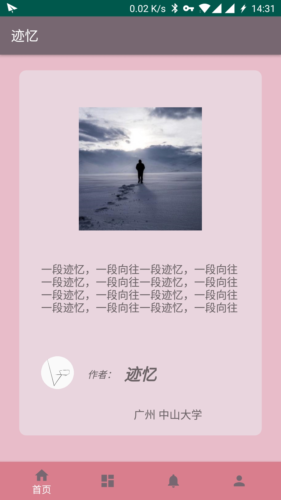


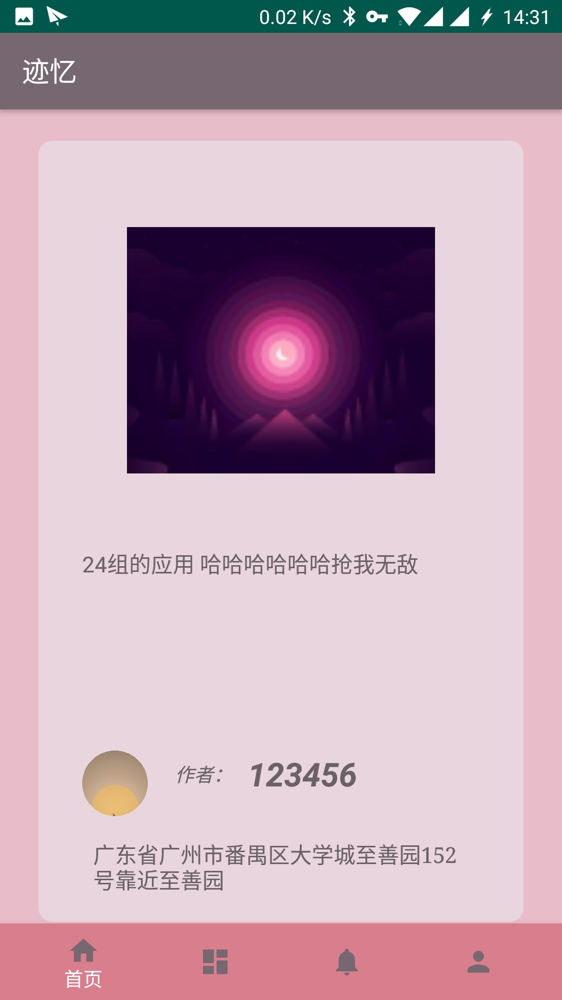

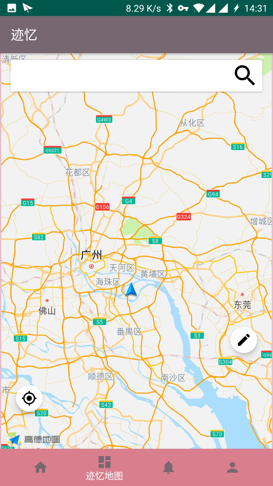

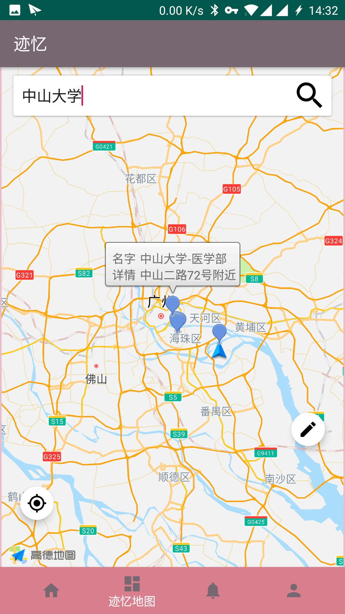


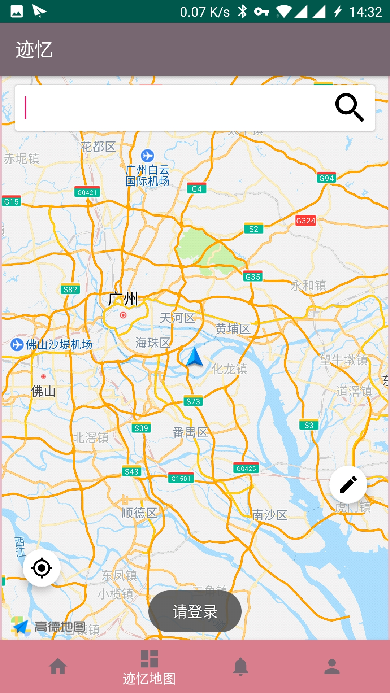

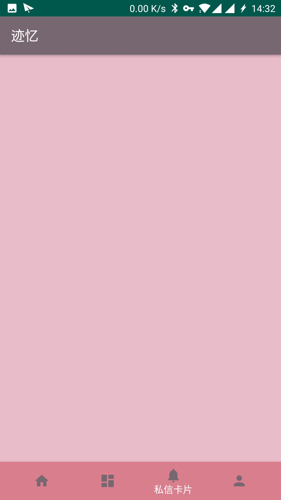

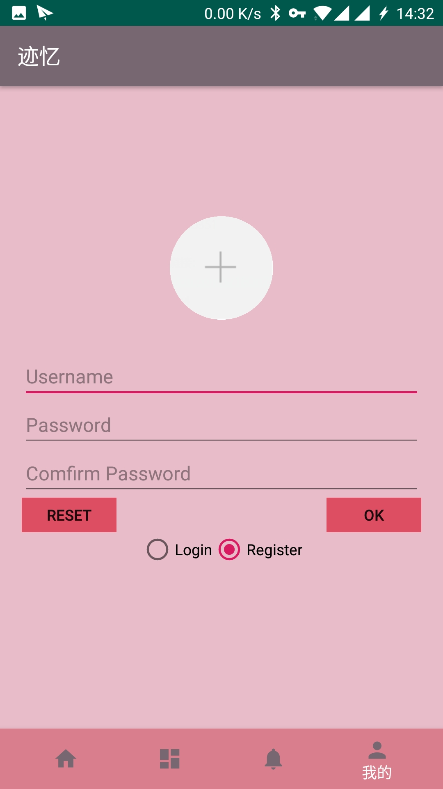

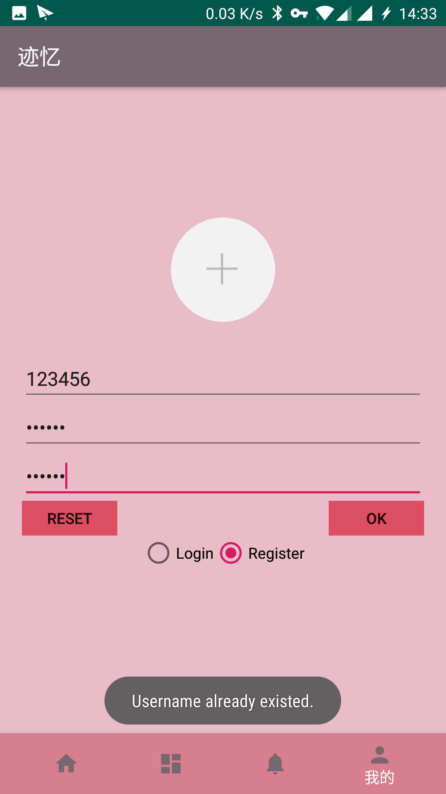


#### 卡片地图

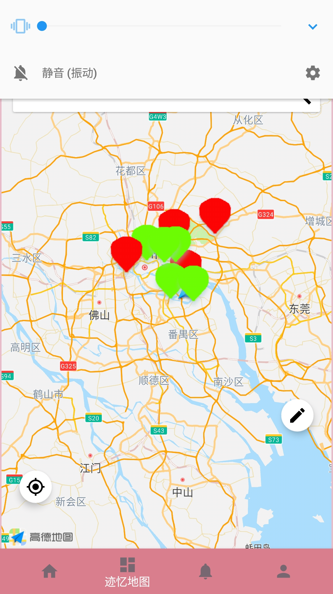

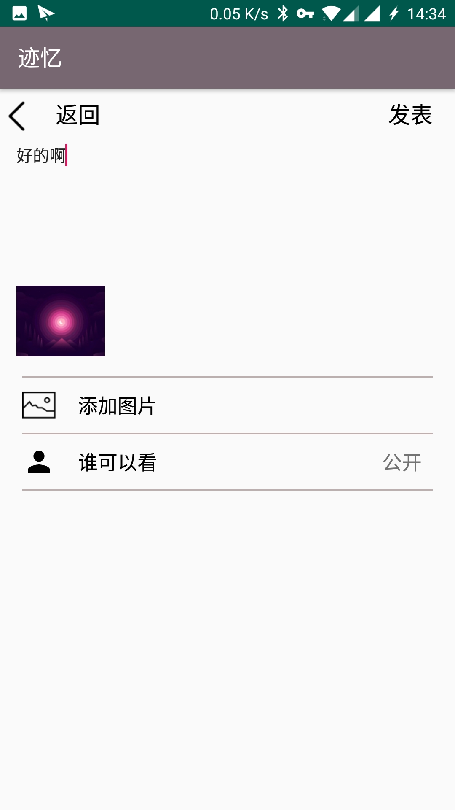

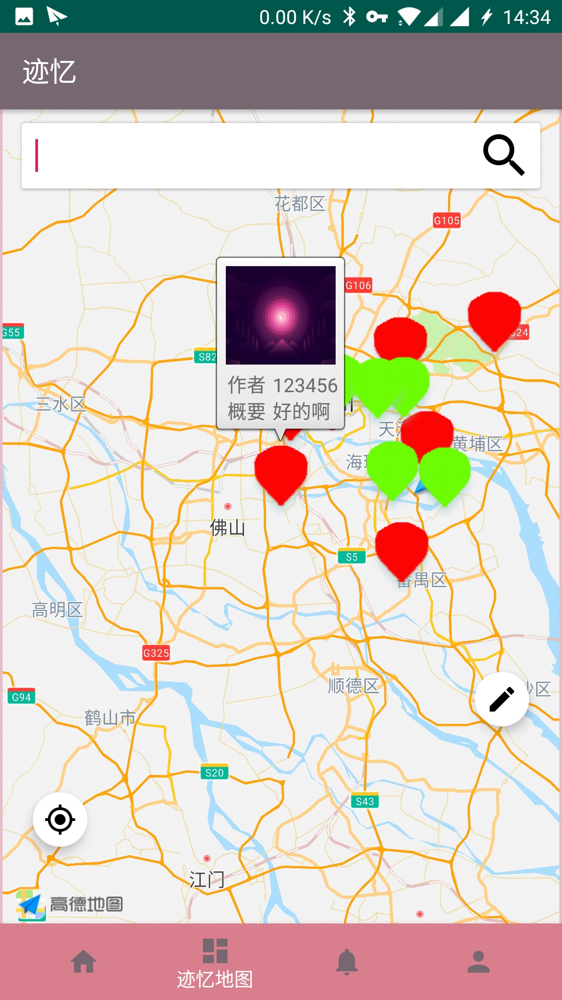

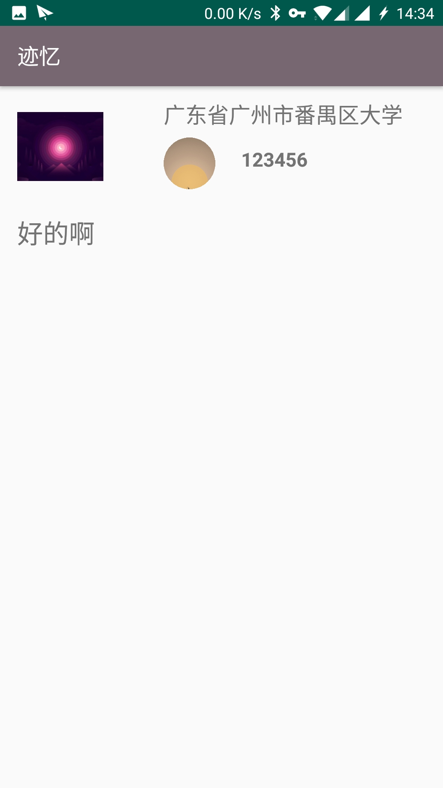


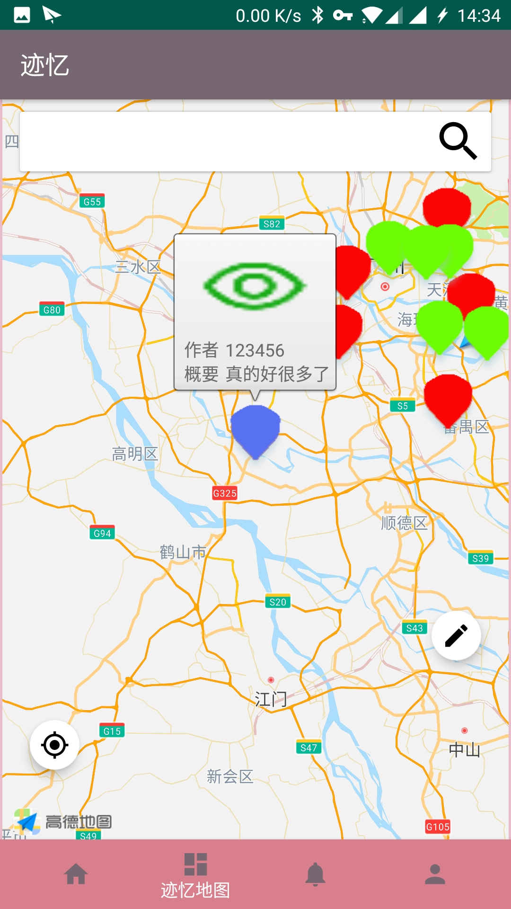

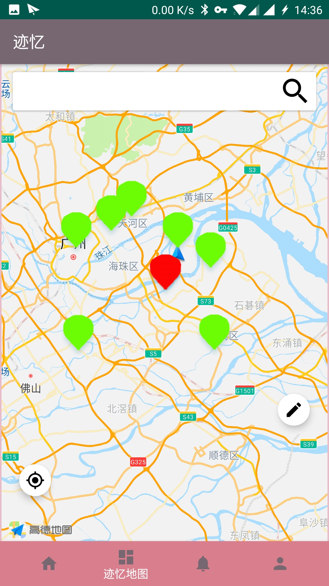

#### 首页
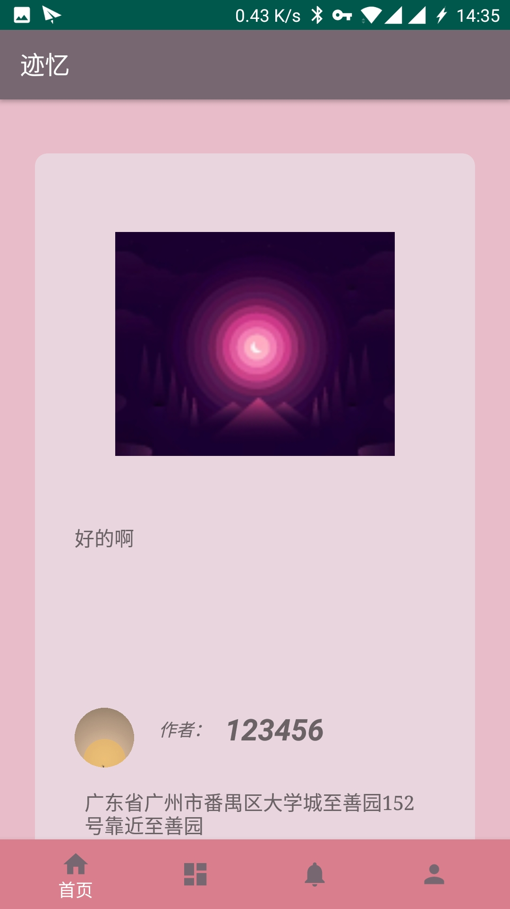

### (2)实验步骤以及关键代码

#### 搭建项目整体框架
  由于项目主要是显示四个页面，分别是  首页（卡片广场），第二页（记忆地图），第三页（私信卡片），第四页（个人登录设置）。通过Android Studio 创建初始MainActivity，包含底栏，四个按钮，点击按钮跳转到相应的Fragment中。每个Fragment就是四个页面。使用BottomNavigationView+ViewPager+Fragment来实现底栏点击按钮跳转到相应的页面。使用Fragment而不是Activity的原因是Fragment的开销比Activity小，将四个Fragment依托到 Activity进行管理，减少了应用的开销。也同时一定程度上避免了Activity的叠加异常。

* 自定义ViewPager
设置不能通过滑动切换Fragment，可以防止在MapFragment中地图的一些误触和bug。设置`setScanScroll(false) `，禁止ViewPager的滑动切换

```
public class MyViewPager extends ViewPager {
    private boolean isCanScroll = false;
    public MyViewPager(@NonNull Context context) {
        super(context);
    }

    public MyViewPager(Context context, AttributeSet attrs) {
        super(context, attrs);
    }
    public void setScanScroll(boolean isCanScroll) {
        this.isCanScroll = isCanScroll;
    }

    @Override
    public boolean onInterceptTouchEvent(MotionEvent ev) {
        return isCanScroll && super.onInterceptTouchEvent(ev);
    }

    @Override
    public boolean onTouchEvent(MotionEvent ev) {
        return isCanScroll && super.onTouchEvent(ev);

    }
}

```

* 继承和重写FragmentPagerAdapter类，设置MyPagerAdapter，适配Fragment

```
public class MyPagerAdapter extends FragmentPagerAdapter {

    private List<Fragment> mFragments;

    public MyPagerAdapter(FragmentManager fm, List<Fragment> mf){
        super(fm);
        this.mFragments = mf;
    }

    @Override
    public int getCount() {
        return mFragments!= null ? mFragments.size():0;
    }

    @Override
    public Fragment getItem(int i) {
        return mFragments.get(i);
    }


}
```

* ViewPager+BottomNavigationView跳转页面
初始化4个Fragment，并添加到ViewPager中。点击底栏 切换Fragment。3

```


private void init(){
        List<Fragment> fragments = new ArrayList<>();

        com.pandatem.jiyi.Fragment.HomeFragment homeFragment = new com.pandatem.jiyi.Fragment.HomeFragment();
        fragments.add(homeFragment);
        com.pandatem.jiyi.Fragment.MapFragment mapFragment = new com.pandatem.jiyi.Fragment.MapFragment();
        fragments.add(mapFragment);
        com.pandatem.jiyi.Fragment.PrivateFragment privateFragment = new com.pandatem.jiyi.Fragment.PrivateFragment();
        fragments.add(privateFragment);
        com.pandatem.jiyi.Fragment.MineFragment mineFragment = new com.pandatem.jiyi.Fragment.MineFragment();
        fragments.add(mineFragment);

        myPagerAdapter = new MyPagerAdapter(getSupportFragmentManager(),fragments);
        mViewPager.setOffscreenPageLimit(4);
        mViewPager.setOnTouchListener(new View.OnTouchListener() {
            @Override
            public boolean onTouch(View v, MotionEvent event) {
                return true;
            }
        });
        mViewPager.setScanScroll(false);
        mViewPager.setAdapter(myPagerAdapter);


    }


 private BottomNavigationView.OnNavigationItemSelectedListener mOnNavigationItemSelectedListener
            = new BottomNavigationView.OnNavigationItemSelectedListener() {

        @Override
        public boolean onNavigationItemSelected(@NonNull MenuItem item) {
            switch (item.getItemId()) {
                case R.id.navigation_home:
                    mViewPager.setCurrentItem(0);
                    return true;
                case R.id.navigation_map:
                    mViewPager.setCurrentItem(1);
                    return true;
                case R.id.navigation_private:
                    mViewPager.setCurrentItem(2);
                    return true;
                case R.id.navigation_mine:
                    mViewPager.setCurrentItem(3);
                    return  true;
            }
            return false;
        }
    };


```

#### 卡片广场的设计与完善

* 卡片广场的设计，使用RecyclerView来显示每一个卡片，每一个卡片需要显示卡片的封面，卡片的内容，卡片的发布者以及发布的地点。

```
 public void initRecycleView(){
       RecyclerView recyclerview =(RecyclerView) mView.findViewById(R.id.recyclerview);


        homeAdapter = new  HomeRecycleViewAdapter<Card>(getContext(),R.layout.item,mData) {

            @Override
            public void convert(HomeViewHolder holder, final Card card) {
                ImageView img_cover  = (ImageView)holder.getView(R.id.img_cover);
                CircleImageView img_user_cover=(CircleImageView)holder.getView(R.id.img_person_cover);
                final TextView tv_content = (TextView)holder.getView(R.id.tv_content);
                TextView tv_position = (TextView)holder.getView(R.id.tv_position);
                TextView tv_user_name=(TextView)holder.getView(R.id.tv_person_name);

                tv_content.setText(card.getContent());
                tv_position.setText(card.getPosition());
                tv_user_name.setText(card.getPerson().getName());


                byte bytes1[] = card.getPerson().getCoverBitmapBytes();
                if(bytes1 != null) {
                    Bitmap bmp1 = BitmapFactory.decodeByteArray(bytes1, 0, bytes1.length);
                    if(bmp1 !=null ){
                        img_user_cover.setImageBitmap(bmp1);
                    }else{
                        img_user_cover.setImageResource(R.mipmap.user);
                    }
                }else{
                    img_user_cover.setImageResource(R.mipmap.user);
                }

                byte bytes2[] = card.getCoverBitmapBytes();
                if(bytes2 != null) {
                    Bitmap bmp2 = BitmapFactory.decodeByteArray(bytes2, 0, bytes2.length);
                    if(bmp2 != null){
                        img_cover.setImageBitmap(bmp2);

                    }else {
                        img_cover.setImageResource(R.mipmap.demo);
                    }
                }else {
                    img_cover.setImageResource(R.mipmap.demo);
                }
                //display only part of the text
                tv_content.setLines(4);
                tv_content.setOnClickListener(new View.OnClickListener() {
                    Boolean flag = true;
                    @Override
                    public void onClick(View v) {
                        if(flag){
                            flag = false;
                            tv_content.setEllipsize(null);
                            tv_content.setMaxLines(100);
                        }else{
                            flag = true;
                            tv_content.setEllipsize(TextUtils.TruncateAt.END);
                            tv_content.setLines(4);
                        }
                    }
                });

                //click the user's cover to start a conversation
                img_user_cover.setOnClickListener(new View.OnClickListener() {
                    @Override
                    public void onClick(View v) {
                        Intent intent = new Intent(getActivity(), ConversationActivity.class);
                        Bundle bundle = new Bundle();
                        String sender = ((MainActivity)getActivity()).getGlobalUsername();
                        String receiver = card.getPerson().getName();
                        if(sender!=null){
                            List<String> users = new ArrayList<String>();
                            users.add(sender);
                            users.add(receiver);
                            bundle.putSerializable("users", (Serializable) users);
                            intent.putExtras(bundle);
                            startActivity(intent);
                        }
                        else {
                            Toast.makeText(getContext(),"Please login before sending messages.", Toast.LENGTH_SHORT).show();
                        }
                    }
                });
            }
        };

        homeAdapter.setOnItemClickListener(new HomeRecycleViewAdapter.OnItemClickListener() {
            @Override
            public void onClick(int position) {

            }
        });

        recyclerview.setLayoutManager(new GridLayoutManager(getContext(),1));

        recyclerview.setAdapter(homeAdapter);

    }

```

* 通过SwipeRefreshLayout 来设置 下拉刷新获得新的卡片

```
public void initRefreshLayout(){
        final SwipeRefreshLayout  mRefreshLayout = (SwipeRefreshLayout)mView.findViewById(R.id.layout_swipe_refresh);

        mRefreshLayout.setOnRefreshListener(new SwipeRefreshLayout.OnRefreshListener(){
            public void onRefresh() {
                //我在List最前面加入一条数据

                mData.clear();
                myDB = new MyDatabase(getContext());
                mData.addAll( myDB.queryAllCard());

                //数据重新加载完成后，提示数据发生改变，并且设置现在不在刷新
                homeAdapter.notifyDataSetChanged();
                mRefreshLayout.setRefreshing(false);
            }
        });
    }

```

#### 记忆地图的设计与完成

* 使用高德地图SDK
添加SDK依赖，由于网络的原因，一直不能通过Gradle添加SDK依赖，所以就只能将SDK下载下来在本地添加依赖，高德地图的官网上的教程有一些小的麻烦。

在项目中添加JniLibs文件夹，其中放入高德地图SDK。在项目设置中添加依赖。

* 使用Amap来显示高德地图
设置Amap的属性，设置地图的样式，设置定位的样式为只定位一次，点击地图上的浮动定位按钮再定位，且视角移动到定位点。设置定位的蓝点显示。去除高德地图默认的按钮。点击定位按钮，通过复写` onLocationChanged(AMapLocation aMapLocation)` 来获得定位，然后在绘制定位蓝点。

```
if(aMap == null){
            aMap = mMapView.getMap();
        }
        MyLocationStyle myLocationStyle;
        myLocationStyle = new MyLocationStyle();//初始化定位蓝点样式类myLocationStyle.myLocationType(MyLocationStyle.LOCATION_TYPE_LOCATION_ROTATE);//连续定位、且将视角移动到地图中心点，定位点依照设备方向旋转，并且会跟随设备移动。（1秒1次定位）如果不设置myLocationType，默认也会执行此种模式。
        myLocationStyle.myLocationType(MyLocationStyle.LOCATION_TYPE_SHOW);
        aMap.setMyLocationStyle(myLocationStyle);//设置定位蓝点的Style
        aMap.getUiSettings().setMyLocationButtonEnabled(false);//设置默认定位按钮是否显示，非必需设置。
        aMap.getUiSettings().setZoomControlsEnabled(false);//设置地图缩放按钮
        aMap.setMyLocationEnabled(true);// 设置为true表示启动显示定位蓝点，false表示隐藏定位蓝点并不进行定位，默认是false。

  FloatingActionButton  flb_location  = (FloatingActionButton)view.findViewById(R.id.flb_location);
        flb_location.setOnClickListener(new View.OnClickListener() {
            @Override
            public void onClick(View v) {
                aMap.setMyLocationEnabled(true);
                mLocationOption.setOnceLocation(true);
                mLocationClient.setLocationOption(mLocationOption);
                //启动定位
                mLocationClient.startLocation();
            }
        });

    @Override
    public void onLocationChanged(AMapLocation aMapLocation) {
                if(aMapLocation != null){
                    if(aMapLocation.getErrorCode() == 0){

                        LatLng latLng = new LatLng(aMapLocation.getLatitude(), aMapLocation.getLongitude());

                        MarkerOptions locationMarker = new MarkerOptions();


                        //添加Marker显示定位位置
                        if (locationMarker == null) {
                            //如果是空的添加一个新的,icon方法就是设置定位图标，可以自定义
                            locationMarker.position(latLng);
                            locationMarker.draggable(false);//设置Marker可拖动
                            //   markerOption.icon(BitmapDescriptorFactory.fromBitmap(BitmapFactory
                            //            .decodeResource(getResources(),R.mipmap.img)));
                            // 将Marker设置为贴地显示，可以双指下拉地图查看效果
                            locationMarker.setFlat(false);//设置marker平贴地图效果
                            aMap.addMarker(locationMarker);
                        } else {
                            //已经添加过了，修改位置即可
                            locationMarker.position(latLng);
                        }

                        //然后可以移动到定位点,使用animateCamera就有动画效果
                        aMap.animateCamera(CameraUpdateFactory.newLatLngZoom(latLng, 10));
                       mLocationClient.stopLocation();

                       card.setPosition(  aMapLocation.getAddress());
                       card.setLatLng_x(aMapLocation.getLatitude() );
                       card.setLatLng_y(aMapLocation.getLongitude());
                    }else {
                        //显示错误信息ErrCode是错误码，errInfo是错误信息，详见错误码表。
                        Log.e("AmapError","location Error, ErrCode:"
                                + aMapLocation.getErrorCode() + ", errInfo:"
                                + aMapLocation.getErrorInfo());
                    }
                }
    }

```

* 设置点击标记Marker，显示InfoWindow包含图片。
由于Android 的设计限制，Infowindow只能显示Marker的Title以及Snippets以及静态的图片。由于项目的设计，需要显示每一个Card的对应的封面图，所以就要有特殊的方法去解决，通过将每一个Card的ID通过Title一起传入到InfoWindowAdapter中，再根据ID在数据库中查询封面，显示在ImageView中。

```

        markerOption.snippet(card.getContent());

        markerOption.title(card.getId()+","+card.getPerson().getName());


public abstract class MyInfoWindowAdapter implements AMap.InfoWindowAdapter,View.OnClickListener {

    private String mCardId;
    private Context mContext;
    private MyDatabase myDB;
    private  Card mCard;

    public MyInfoWindowAdapter(Context context) {
        mContext = context;
        myDB = new MyDatabase(context);

    }

    @Override
    public View getInfoWindow(Marker marker) {
        View infoWindow = LayoutInflater.from(mContext).inflate(
                R.layout.info, null);
        render(marker, infoWindow);
        return infoWindow;
    }
    @Override
    public View getInfoContents(Marker marker) {
        return null;
    }


    public void render(Marker marker, View view) {

        TextView titleUi = ((TextView) view.findViewById(R.id.tv_info_title));
        ImageView imageView = (ImageView) view.findViewById(R.id.imgv_info);
        TextView contentUi = ((TextView) view.findViewById(R.id.tv_info_content));
        TextView tv_info_name1 = ((TextView) view.findViewById(R.id.tv_info_name1));
        TextView tv_info_name2 = ((TextView) view.findViewById(R.id.tv_info_name2));


        if(marker.getTitle() == null|| marker.getSnippet() == null){
            imageView.setVisibility(View.GONE);
            tv_info_name1.setText("请输入内容");
            titleUi.setText("");
            contentUi.setText("");
            tv_info_name2.setText("");;
            return;
        }

        String Title = marker.getTitle();
        String [] str =  Title.split(",");
        if(str.length == 2) {
            mCard =  myDB.queryCardById(new Integer(str[0]));
            if(mCard != null){
                byte bytes[] = mCard.getCoverBitmapBytes();
                Bitmap bmp = BitmapFactory.decodeByteArray(bytes,0,bytes.length);
                if(bmp != null)
                {
                    imageView.setImageBitmap(bmp);
                    imageView.setTag(mCard.getId());
                    imageView.setVisibility(View.VISIBLE);
                }
                tv_info_name1.setText("作者");
                tv_info_name2.setText("概要");

                mCardId = str[0];
                titleUi.setText(str[1]);

                //点击跳转
                //imageView.setImageResource(R.mipmap.user);
                imageView.setOnClickListener(this);
            }else{
                return;
            }

        }else{
            imageView.setVisibility(View.GONE);
            tv_info_name1.setText("名字");
            tv_info_name2.setText("详情");
            titleUi.setText(Title);
        }


        if(marker.getSnippet().length() > 10) {
            contentUi.setText(marker.getSnippet().substring(0, 8));
        }else {
            contentUi.setText(marker.getSnippet());

        }


    }

}


```

* 设计点击InfoWindow中的封面，跳转到卡片详情页面，点击文字隐藏InfoWindow。
点击文字隐藏InfoWindow，只需要在Amap中设置点击InfoWindow，进行marker.hideInfoWindow();就可以了。点击InfoWindow的图片跳转到对应的卡片的详情页面，由于跳转事件不能在InfoWindowAdapter中进行，所以需要将类设置为抽象类，并在MapFragment中实现，但是在MapFragment中实现的时候不能直接获得点击的Card的id，由于点击事件是通过判断View的ID实现的，所以在Adapter中将得到的id写入view的tag中，再在Fragment中通过View的tag获得id，再设置Intent跳转。

```

imageView.setTag(mCard.getId());


MyInfoWindowAdapter info = new MyInfoWindowAdapter(getContext()) {
            @Override
            public void onClick(View v) {
                int id = v.getId();
                if(id==R.id.imgv_info) {

                    Integer i = (Integer) v.getTag();
                    if(i != null) {
                 //       Toast.makeText(getContext(), "跳转，cardID = " +i.toString(),Toast.LENGTH_SHORT).show();
                        Intent intent = new Intent(getContext(),CardDetailActivity.class);
                        intent.putExtra("cardId",i);
                        startActivity(intent);
                    }

                }
            }
        };

```

* 显示不同类型的卡片Marker，绿色：其他人的公共卡片，红色：自己的公共卡片，紫色：自己的私有卡片。

通过判断当前卡片的作者是不是登陆的用户，来设置Marker的颜色是不是绿色，如果是当前登陆的用户还要判断发布的卡片是不是私有的。

```

  if(card.getPerson().getName().equals(userName)) {
            if(card.getPrivate()){
                markerOption.icon(BitmapDescriptorFactory.fromBitmap(BitmapFactory.decodeResource(getResources(), R.mipmap.marker_bg_p)));
            }else {
                markerOption.icon(BitmapDescriptorFactory.fromBitmap(BitmapFactory.decodeResource(getResources(), R.mipmap.marker_bg_red)));
            }
        }else{
            markerOption.icon(BitmapDescriptorFactory.fromBitmap(BitmapFactory.decodeResource(getResources(), R.mipmap.marker_bg_green)));
        }

```

### (3)实验遇到的困难以及解决思路
  
1. ViewPager以及Fragment的应用，由于前期完全没有接触过这两个控件，使用这两个控件的时候遇到很多的问题。首先是选择这两个控件来组成基本框架，通过一个MainActivity来控制四个Fragment，这样应用的开销会小一些，同时通过ViewPager来切换Fragment，这样使得切换的过度比较自然，同时由于在使用高德地图的时候需要禁止ViewPager的滑动切换。需要自己重新写一个ViewPagerAdapter。

2. 使用高德地图的SDK的时候，不知道是网络的原因还是Maven的原因一直不能通过Gradle来获得高德地图的SDK依赖，后面不得不将SDK本地的放入项目。同时还需要配置高德地图的Key，获得这个key还需要知道项目的SHA1，以及PackageName。debug版本和release版本还需要申请不同的key。

3. 使用AMap构建地图的容器，由于高德地图只提供了7种定位的形式，与项目需求不太符合，就需要自定义定位的形式。通过在AMap容器之上添加一个FloatButton来实现，点击按钮获得定位信息，并将视角移动到定位点。不进行自动定位，这样可以避免一直使用定位功能造成大量的耗电

4. 显示地图Marker，要显示每一个卡片对应的Marker就需要知道地点信息，这个地点信息记录在LatLng类型中，但是由于我们的Card类型需要序列化，所以需要将LatLng类型转化为2个Double类型表示经纬度。然后再转化为LatLng，得到Marker的位置，然后根据卡片的性质，来显示Marker的图片。为了能够显示大量的Marker，就需要将Marker放入到List中，每一次进入地图界面就渲染所有的Marker。

5. 显示InfoWindow，会根据card的信息自动更新显示的图片。由于Infowindow是绑定在AMap上，而且只能够从Marker中获得Marker的Title以及SnopShot，无法加载每一个Marker的图片。一开始是想将图片信息Byte[] 类型转化为String类型然后通过Marker的Title传送，之后再从Marker中获得图片。发现这样是不能传送的，因为图片的信息太多，Title有长度的限制。后面就只能通过数据库来解决了，通过把CardID打包到Title中，然后解析，再在数据库中进行查询图片，显示图片。Card的Marker还要与搜索得到的POI数据进行区分，因为POI数据不包含封面图片。通过传入的Title来判断类型。

6. 搜索POI数据，通过高德地图API搜索地点信息，需要对PoiSearch类型进行重写，自定义。由于这个请求是需要联网的所以需要进行网络调用，使用的SDK中包含了请求的处理，对获得结果进行解析就行了，由于功能的侧重性，自定义其搜索结果只显示5条信息。


 
---


## 四、实验思考及感想

 课程将Android的基础部分讲解完成了。相较于期中项目，本次的项目从选题到完成都是一个挑战。项目的难度也进行了提升，需要使用大量的新的控件，以及使用高德地图SDK。有一个好的使用教程很重要，是使用高德SDK之后的感受。需要的功能并不是SDK就可以解决的，有时还需要对SDK功能进行一定程度的自定义。由于高德地图的文档较为成熟，遇见的坑大部分可以解决，不能解决的也可以通过其他方法绕过实现相同的功能。由于项目比较复杂，基础结构的设计尤为重要，一开始是想使用开源的框架的，但是后来想想如果可以自己设计完成这些结构，会使得自己的技能提升的更加多。后面就是用了ViewPager+Fragment来构建基本的项目结构。虽然使用的时候遇到了一些麻烦，有些还造成了项目进度的拖延，但是结果还是好的，达到了预期的目标。

## 五、个人贡献评分

100

---

#### 作业要求
* 命名要求：学号_姓名_实验编号，例如12345678_张三_lab1.md
* 实验报告提交格式为md
* 实验内容不允许抄袭，我们要进行代码相似度对比。如发现抄袭，按0分处理