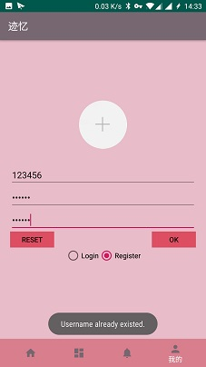
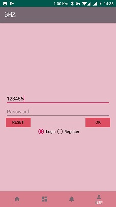
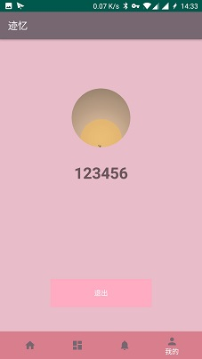

# 中山大学数据科学与计算机学院本科生实验报告
## （2018年秋季学期）
| 课程名称 | 手机平台应用开发 | 任课老师 | 郑贵锋 |
| :------------: | :-------------: | :------------: | :-------------: |
| 年级 | 2016级 | 专业（方向） | 软件工程（电子政务） |
| 学号 | 16340301 | 姓名 | 赵俊祥 |
| 电话 | 15920804547 | Email | 1773133512@qq.com |
| 开始日期 | 12.20 | 完成日期 |1.20|

---

## 一、实验题目 迹忆

---

## 二、个人实现内容 

- 需求分析与功能设计
- 实现应用的注册、登陆功能，用户可以进行基本的注册和登陆，登陆之后才能在地图上看到卡片信息、私信并使用发送信息的功能。
- 实现部分数据库，主要与用户信息相关的数据库内容
- UI的改进
- 小组报告

---

## 三、课堂实验结果
### (1)实验截图

- 注册功能

   

- 登陆功能

  

- 主页卡片效果图

   

### (2)实验步骤以及关键代码

- 登陆注册功能

  该界面的xml文件包含了三个ConstraintLayout，分别包含了注册界面、登陆界面和登陆成功后的用户信息界面。启动应用时，显示注册界面，通过RadioButton来切换至登陆界面，登陆成功后则把注册和登陆界面的layout的Visibility设置为GONE。

  ````java
  //after login
  byte[] cover = myDB.getCover(editUsername.getText().toString());
  username.setText(editUsername.getText().toString());
  userCover.setImageBitmap(BitmapFactory.decodeByteArray(cover, 0,cover.length));
  layout1.setVisibility(View.GONE);
  layout2.setVisibility(View.VISIBLE);
  ((MainActivity)getActivity()).setGlobalUsername(editUsername.getText().toString());
  ````

- 数据库的实现

  使用SQLite实现数据库。定义一个MyDatabase类，继承SQLiteOpenHelper类，然后在onCreate函数中创建表格。用户的表格保存了用户名、密码、头像等信息，以用户名作为键值。头像的存储使用BLOB类型，即字节类型。所以读取图片时，需要先从uri得到Bitmap，然后把Bitmap转换成Byte数组再存进数据库。从uri得到bitmap时，先进行图片的压缩避免内存过载。然后使用bitmap.compress方法转换得到字节数组。

  ````java
  //create table
  String CREATE_USER_TABLE = "CREATE TABLE if not exists " + USER_TABLE_NAME +
      " (username TEXT PRIMARY KEY, password TEXT, photo BLOB)";
  //insert user
  SQLiteDatabase db = getWritableDatabase();
  ContentValues values = new ContentValues();
  values.put("username", user.getName());
  values.put("password", user.getPassword());
  values.put("photo", user.getCoverBitmapBytes());
  long rid = db.insert(USER_TABLE_NAME,null, values);
  db.close();
  //convert bitmap to byte array
  Bitmap bitmap = getBitmapFormUri(getActivity(),uri);
  chosenCover.setImageBitmap(bitmap);
  //bitmap to byteArray
  ByteArrayOutputStream byteStream = new ByteArrayOutputStream();
  bitmap.compress(Bitmap.CompressFormat.PNG, 100, byteStream);
  photo = byteStream.toByteArray();
  ````

- 不同fragment间传递变量。本次项目的四个界面是使用fragment实现的，同属于一个Activity。所以变量的传递没必要使用intent和bundle进行传递，节约了资源的使用。简单的方法是在MainActivity中定义全局变量，然后提供公有的setter和getter接口，在不同的fragment中调用这两个接口进行操作即可。调用时需要用(MainActivity)getActivity()指明调用的哪个Activity的函数。

  ````java
  public String getGlobalUsername(){
      return globalUsername;
  }
  public void setGlobalUsername(String str){
      this.globalUsername = str;
  }
  //calling
  ((MainActivity)getActivity()).setGlobalUsername(editUsername.getText().toString());
  ````

- 界面改进。为了美观，主页中显示的卡片大小是相同的，所以当用户发送的内容过多时，有些内容是无法显示的。改进方法是将textview的行数设定为固定4行，然后添加一个点击事件,设置一个flag记录textview当前处于展开状态还是省略状态，如果是省略状态，则取消行数的限制，显示所有内容，反之则把多于四行的内容隐藏，显示省略号。

  ````java
  //display only part of the text
  tv_content.setLines(4);
  tv_content.setOnClickListener(new View.OnClickListener() {
      Boolean flag = true;
      @Override
      public void onClick(View v) {
          if(flag){
              flag = false;
              tv_content.setEllipsize(null);
              tv_content.setMaxLines(100);
          }else{
              flag = true;
              tv_content.setEllipsize(TextUtils.TruncateAt.END);
              tv_content.setLines(4);
          }
      }
  });
  ````

  

### (3)实验遇到的困难以及解决思路

- 完成数据库部分后，注册功能正常，但是登陆时总是出现问题。最后的问题在于cursor和db调用后没有关闭，导致后面的读取出现问题。解决方法是每次完成数据库操作后都把cursor和db关闭。

---

## 四、个人总结与个人评分

本次项目我负责的功能大都是之前作业完成过的，所以实现的过程比较顺利，遇到的问题比较少。数据库的问题一开始只在虚拟机上测试，觉得没问题后就合并到项目里了，结果部分组员用手机进行测试时出现了问题，所以又进行了一些修改。得到的教训就是在进行充分的测试之前不要轻易把代码合并到项目里。在设计应用的功能时，考虑到这个应用就是希望提供一个匿名，自由的分享平台，所以没有加好友的功能，也没有点赞评论功能，纯粹是一个分享和轻聊天平台。设计私信功能，考虑的是在数据库中保存信息的发送者、接收者、信息内容和时间四个属性。然后每个用户登陆时，把所有发送者或者接收者有该用户的信息读取出来，然后根据不同的对话双方进行分类，再按照时间进行排序，呈现出一个个消息列表。地图功能的实现都是由另一名组员实现的，所以我参与得比较少。只是在地图上显示卡片时，根据当前用户名显示不同的卡片，把相关代码封装成函数，减少了冗余代码。

总体来说，本次项目我主要实现的功能是注册登陆和UI改进，但是其他部分的设计也有一定的参与。我们的项目特色地图分享功能则是参与的比较少，所以对于API的使用上存在很多不足，需要反省，给自己打分90分。


---

## 

