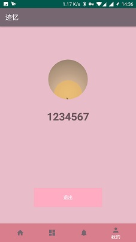

# 中山大学数据科学与计算机学院本科生实验报告
## （2018年秋季学期）
| 姓名 | 学号 |
| :------------: | :-------------: |
| 张晓帆 | 16340293 |
| 张星 | 16340294 |
| 张子权 | 16340296 |
| 赵俊祥 | 16340301 |

---

## 一、应用基本信息 

- 应用名：迹忆
- 基本功能
  - 迹忆广场：应用的首页，能随机推荐其他用户发送的卡片，可以查看卡片内容，向卡片的主人发送私信
  - 迹忆地图：具备地图功能，可以在地图上的相应位置发送卡片动态，可以看到自己和别人发送的卡片所处的位置
  - 消息中心：可以查看别人发来的私信，并进行对话
  - 我的迹忆：注册登陆功能，登陆后才能使用发送动态和私信功能。

---

## 二、界面截图

- 首页：随机推荐几张卡片给用户

  

- 迹忆地图

  

- 发送动态

  

- 私信功能

  

- 登陆注册

  

---

## 三、架构图与时序图

- 项目架构

  

- 时序图

  

---

## 四、技术设计

- 总体框架：由于项目主要是显示四个页面，分别是  首页（卡片广场），第二页（记忆地图），第三页（私信卡片），第四页（个人登录设置）。通过Android Studio 创建初始MainActivity，包含底栏，四个按钮，点击按钮跳转到相应的Fragment中。每个Fragment就是四个页面。使用BottomNavigationView+ViewPager+Fragment来实现底栏点击按钮跳转到相应的页面。使用Fragment而不是Activity的原因是Fragment的开销比Activity小，将四个Fragment依托到 Activity进行管理，减少了应用的开销。也同时一定程度上避免了Activity的叠加异常。

  ````java
  public class MyPagerAdapter extends FragmentPagerAdapter {
      private List<Fragment> mFragments;
      public MyPagerAdapter(FragmentManager fm, List<Fragment> mf){
          super(fm);
          this.mFragments = mf;
      }
      @Override
      public int getCount() {
          return mFragments!= null ? mFragments.size():0;
      }
      @Override
      public Fragment getItem(int i) {
          return mFragments.get(i);
      }
  }
  ````

- 数据库的实现使用SQLite，既满足功能需求，又是一个轻量级数据库，减少了应用的负载。

- 地图的设计与完成：使用高德地图SDK，添加SDK依赖，由于网络的原因，一直不能通过Gradle添加SDK依赖，所以就只能将SDK下载下来在本地添加依赖。然后使用Amap来显示地图，用Marker实现点击的标记。

---

## 五、成员贡献表和Git提交记录

| 姓名 | 负责内容 |评分|
| :------------: | :-------------: | :-------------: |
| 张晓帆 | 项目框架，地图的实现，卡片的设计 | 100 |
| 张星 | UI设计、发送卡片功能，私信功能实现 | 100 |
| 张子权 | 数据库实现，私信功能实现 | 100 |
| 赵俊祥 | 注册登陆功能，部分数据库与UI改进 | 100 |

Git提交记录参照Gitee的commit记录。

---

## 六、应用部署方法与测试结果

- 部署方法：可以使用AndroidStudio打开项目，build完成后在虚拟机或者安卓手机上运行即可。也可以直接下载当前文件夹中的jiyi.apk，安装在手机上运行，需要提供定位，网络，存储等权限。
- 测试结果
  - 成员自测：通过小组成员自己的测试，实现的功能中不存在bug，对于异常的输入和操作也做了相应的处理。