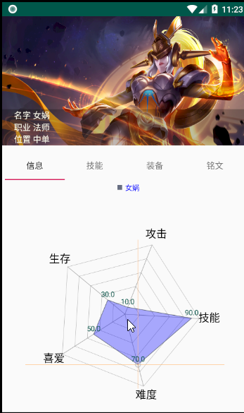

# 中山大学数据科学与计算机学院本科生实验报告
## （2018年秋季学期）
| 课程名称 | 手机平台应用开发 | 任课老师 | 郑贵锋 |
| :------------: | :-------------: | :------------: | :-------------: |
| 年级 | 16级 | 专业（方向） | 电子政务 |
| 学号 | 16340293 | 姓名 | 张晓帆 |
| 电话 |  | Email |  |
| 开始日期 | 11.12 | 完成日期 | 11.24

---

## 一、实验题目

期中项目-王者荣耀英雄大全
---

## 二、实现内容

* 一个包括王者荣耀英雄人物头像、称号、名字、位置、生存能力值、攻击伤害值、技能效果值、上手难度值等信息的APP
* 王者荣耀英雄人物的增删改查功能。属性包含头像、称号、名字、位置、生存能力值、攻击伤害值、技能效果值、上手难度值等，其中头像是图片
* App启动时初始化包含10个英雄信息
* 数据库保存、UI界面美化

### 我负责的内容

* 构建项目基本框架
* 英雄列表的实现
* 英雄详情页面的实现
* 数据库的调整


---

## 三、课堂实验结果
### (1)实验截图

* 首页

   
 
* 英雄列表

     
   


* 英雄详情页

   
  

* 英雄技能描述

   
   
* 英雄推荐装备

   
   

* 英雄推荐铭文

   
   

* 英雄信息调整

   
   

* 展开技能

   
   

### (2)实验步骤以及关键代码

* 英雄列表实现一行三列，并对每一个英雄图像响应对应的跳转。最主要的部分就是页面的显示以及点击事件的判断，由于一个list中有3个英雄，在原本一个list中放入三个item。就需要有特殊的布局。并且要对显示函数进行优化。由于Adaper中传入的是一个英雄ArrayList，每一个list又需要对应三个英雄，就需要在所有英雄不是三的倍数的时候进行处理。如果最后一列只有一个，就隐藏后两个头像和标签。如果最后一列有两个就需要隐藏后一个头像和标签。还需要对每一个图像设置点击的事件监听，由于需要在界面中更新数据库，所以将每一个的点击事件设置为一个接口，在外部调用和实现。

```xml
<?xml version="1.0" encoding="utf-8"?>
    <android.support.constraint.ConstraintLayout xmlns:android="http://schemas.android.com/apk/res/android"
        xmlns:app="http://schemas.android.com/apk/res-auto"
        xmlns:tools="http://schemas.android.com/tools"
        android:id="@+id/constraintlayout_hero"
        android:layout_width="match_parent"
        android:layout_height="120dp"
        tools:layout_editor_absoluteY="81dp">


    <android.support.constraint.ConstraintLayout
        android:id="@+id/item_hero_1"
        android:layout_width="0dp"
        android:layout_height="120dp"
        app:layout_constraintEnd_toStartOf="@id/item_hero_2"
        app:layout_constraintHorizontal_weight="1"
        app:layout_constraintStart_toStartOf="parent"
        app:layout_constraintTop_toTopOf="parent">

        <ImageView
            android:id="@+id/iv_item_1_icon"
            android:layout_width="90dp"
            android:layout_height="90dp"
            android:layout_marginTop="5dp"
            android:layout_marginEnd="15dp"
            android:scaleType="centerCrop"
            android:src="@mipmap/gongsonli"
            app:layout_constraintEnd_toEndOf="parent"
            app:layout_constraintTop_toTopOf="parent" />

        <TextView
            android:id="@+id/tv_item_1_name"
            android:layout_width="90dp"
            android:layout_height="18dp"

            android:layout_marginEnd="15dp"

            android:layout_marginBottom="5dp"
            android:text="安其拉"
            android:textAlignment="center"
            app:layout_constraintBottom_toBottomOf="parent"
            app:layout_constraintEnd_toEndOf="parent" />


    </android.support.constraint.ConstraintLayout>

    <android.support.constraint.ConstraintLayout
        android:id="@+id/item_hero_2"
        android:layout_width="0dp"
        android:layout_height="120dp"
        app:layout_constraintEnd_toStartOf="@id/item_hero_3"
        app:layout_constraintHorizontal_weight="1"
        app:layout_constraintStart_toEndOf="@id/item_hero_1"
        app:layout_constraintTop_toTopOf="parent">

        <ImageView
            android:id="@+id/iv_item_2_icon"
            android:layout_width="90dp"
            android:layout_height="90dp"
            android:layout_marginStart="20dp"
            android:layout_marginTop="5dp"
            android:layout_marginEnd="20dp"
            android:scaleType="centerCrop"
            android:src="@mipmap/gongsonli"
            app:layout_constraintEnd_toEndOf="parent"
            app:layout_constraintStart_toStartOf="parent"
            app:layout_constraintTop_toTopOf="parent" />

        <TextView
            android:id="@+id/tv_item_2_name"
            android:layout_width="90dp"
            android:layout_height="18dp"

            android:layout_marginStart="10dp"

            android:layout_marginEnd="10dp"
            android:layout_marginBottom="5dp"
            android:text="安其拉"
            android:textAlignment="center"
            app:layout_constraintBottom_toBottomOf="parent"
            app:layout_constraintEnd_toEndOf="parent"
            app:layout_constraintStart_toStartOf="parent" />

    </android.support.constraint.ConstraintLayout>

    <android.support.constraint.ConstraintLayout
        android:id="@+id/item_hero_3"
        android:layout_width="0dp"
        android:layout_height="120dp"
        app:layout_constraintEnd_toEndOf="parent"
        app:layout_constraintHorizontal_weight="1"
        app:layout_constraintStart_toEndOf="@id/item_hero_2"
        app:layout_constraintTop_toTopOf="parent">

        <ImageView
            android:id="@+id/iv_item_3_icon"
            android:layout_width="90dp"
            android:layout_height="90dp"
            android:layout_marginStart="15dp"
            android:layout_marginTop="5dp"
            android:scaleType="centerCrop"
            android:src="@mipmap/gongsonli"
            app:layout_constraintStart_toStartOf="parent"
            app:layout_constraintTop_toTopOf="parent" />

        <TextView
            android:id="@+id/tv_item_3_name"
            android:layout_width="90dp"
            android:layout_height="18dp"

            android:layout_marginStart="15dp"

            android:layout_marginBottom="5dp"
            android:text="安其拉"
            android:textAlignment="center"
            app:layout_constraintBottom_toBottomOf="parent"
            app:layout_constraintStart_toStartOf="parent" />

    </android.support.constraint.ConstraintLayout>

</android.support.constraint.ConstraintLayout>
```

```java

@Override
    public View getView(final int position, View convertView, ViewGroup parent) {
        View view ;
        final ViewHolder holder;
        if(convertView ==null){
            view = LayoutInflater.from(_context).inflate(_layoutId, null);
            holder = new ViewHolder();
            holder.hero_1_name  = (TextView)view.findViewById(R.id.tv_item_1_name);
            holder.hero_1_icon = (ImageView)view.findViewById(R.id.iv_item_1_icon);

            holder.hero_2_name  = (TextView)view.findViewById(R.id.tv_item_2_name);
            holder.hero_2_icon = (ImageView)view.findViewById(R.id.iv_item_2_icon);

            holder.hero_3_name  = (TextView)view.findViewById(R.id.tv_item_3_name);
            holder.hero_3_icon = (ImageView)view.findViewById(R.id.iv_item_3_icon);

            view.setTag(holder);

        }else{
            view = convertView;
            holder = (ViewHolder)view.getTag();
        }


      if(_heros.size() > position*3) {
          //       Bitmap bitmap_1 = BitmapFactory.decodeByteArray(_heros.get(position*3).getIcon(),0,_heros.get(position*3).getIcon().length);

          //       holder.hero_1_icon.setImageBitmap(bitmap_1);

          holder.hero_1_name.setText(_heros.get(position * 3).getName().toString());
          String id = Integer.toString(_heros.get(position * 3).getId());

          byte[] image = _heros.get(position * 3).getIcon();
          Bitmap bmp = null;
          if(image !=null)
          {
              bmp = BitmapFactory.decodeByteArray(image, 0, image.length);
          }
          holder.hero_1_icon.setImageBitmap(bmp);

          holder.hero_1_icon.setOnClickListener(new View.OnClickListener() {
                @Override
                public void onClick(View v) {
                    _onItemHero1ClickListener.onHero1Click(position);
                }
            });

            //最后一行，第二列，第三列没有
            if (position * 3 + 1 == _heros.size()) {
                holder.hero_2_icon.setVisibility(View.INVISIBLE);
                holder.hero_2_name.setVisibility(View.INVISIBLE);

                holder.hero_3_icon.setVisibility(View.INVISIBLE);
                holder.hero_3_name.setVisibility(View.INVISIBLE);

            } else {
                holder.hero_2_icon.setVisibility(View.VISIBLE);
                holder.hero_2_name.setVisibility(View.VISIBLE);

                //           Bitmap bitmap_2 = BitmapFactory.decodeByteArray(_heros.get(position*3+1).getIcon(),0,_heros.get(position*3+1).getIcon().length);

                //           holder.hero_2_icon.setImageBitmap(bitmap_2);
                holder.hero_2_name.setText(_heros.get(position * 3 + 1).getName().toString());
                byte[] image2 = _heros.get(position * 3 + 1).getIcon();
                Bitmap bmp2 = null;
                if(image2 !=null)
                {
                    bmp2 = BitmapFactory.decodeByteArray(image2, 0, image2.length);
                }
                holder.hero_2_icon.setImageBitmap(bmp2);
                holder.hero_2_icon.setOnClickListener(new View.OnClickListener() {
                    @Override
                    public void onClick(View v) {
                        _onItemHero2ClickListener.onHero2Click(position);
                    }
                });
            }

            //最后一行，第三列没有
            if (position * 3 + 2 == _heros.size() || position * 3 + 1 == _heros.size()) {

                holder.hero_3_icon.setVisibility(View.INVISIBLE);
                holder.hero_3_name.setVisibility(View.INVISIBLE);

            } else {
                holder.hero_3_icon.setVisibility(View.VISIBLE);
                holder.hero_3_name.setVisibility(View.VISIBLE);

                //           Bitmap bitmap_3 = BitmapFactory.decodeByteArray(_heros.get(position*3+2).getIcon(),0,_heros.get(position*3+2).getIcon().length);

//            holder.hero_3_icon.setImageBitmap(bitmap_3);
                holder.hero_3_name.setText(_heros.get(position * 3 + 2).getName().toString());
                byte[] image3 = _heros.get(position * 3 + 2).getIcon();
                Bitmap bmp3 = null;
                if(image3 !=null)
                {
                    bmp3 = BitmapFactory.decodeByteArray(image3, 0, image3.length);
                }
                holder.hero_3_icon.setImageBitmap(bmp3);

                holder.hero_3_icon.setOnClickListener(new View.OnClickListener() {
                    @Override
                    public void onClick(View v) {
                        _onItemHero3ClickListener.onHero3Click(position);
                    }
                });
            }


        }

        return view;
    }

```

* 英雄详情信息，详情信息需要一个大的背景图，需要展示其名字，位置，职业等消息。需要对背景图进行一个处理，凸显出英雄信息。所以我在图片上加入了一个drawable 使得图片下部分有一点模糊变暗，这样就可以突出显示英雄的信息。

```xml
<?xml version="1.0" encoding="utf-8"?>
<selector xmlns:android="http://schemas.android.com/apk/res/android" >

    <item android:state_pressed="false" android:drawable="@color/black4" />
    <item android:state_pressed="true" android:drawable="@color/black4" />
</selector>

```

* 使用ViewPager以及TabLayout实现详情页的布局。由于详情页的需要一个Activity，同时需要展示“信息”“技能”“装备”“铭文”这些信息，而且这些信息需要有一些分隔。需要实现ViewPager的Adapter，获得每一个viewpage。我将每一个page的布局以及其中的数据都保存在一个View 的List 中，将这个View List传入到自定义的MyPagerAdapter中，在获得显示时就会更加方便，直接使用View数据据可以了，免去了在Adapter中对布局UI的设置。

```java


 public void initViewPaper(){

        _views = new ArrayList<View>();

        initViewData();

        String [] _titles  = {"信息","技能","装备","铭文"} ;
        ViewPager vp_hero_content = (ViewPager)findViewById(R.id.vp_hero_content);
        MyPagerAdapter myPagerAdapter = new MyPagerAdapter(this,_views,_titles);
        vp_hero_content.setAdapter(myPagerAdapter);

    }

    //初始化信息，技能，装备，铭文的内容
    public void initViewData() {

       View viewpagerA  = initViewPaperInfo();
       View viewpagerB  =initViewPaperSkill();
       View  viewpagerC = initViewPaperEquipment();
       View viewpagerD = initViewPaperInscription();

        _views = new ArrayList<>();
        _views.add(viewpagerA);
        _views.add(viewpagerB);
        _views.add(viewpagerC);
        _views.add(viewpagerD);

    }


    //初始化信息的内容
    public View initViewPaperInfo() {
        View viewpagerA = getLayoutInflater().inflate(R.layout.viewpager_info, null);

        RadarChart radarChart  = (RadarChart)viewpagerA.findViewById(R.id.radarchart);

        setData(radarChart);


        return viewpagerA;
    }
    //初始化技能的内容
    public View initViewPaperSkill() {
        View viewpagerB = getLayoutInflater().inflate(R.layout.viewpager_skill, null);

        ListView lv_vp_skill = (ListView)viewpagerB.findViewById(R.id.lv_vp_skill);

        MyViewPagerListViewAdapter mySkillAdapter = new MyViewPagerListViewAdapter(this,R.layout.viewpager_listview,_skills,0);
        lv_vp_skill.setAdapter(mySkillAdapter);

        return viewpagerB;
    }
    //初始化装备的内容
    public View initViewPaperEquipment() {
        View viewpagerC = getLayoutInflater().inflate(R.layout.viewpager_equipment, null);

        TextView tv_vp_equipmentsTip = (TextView)viewpagerC.findViewById(R.id.tv_vp_equipmentTip);
        tv_vp_equipmentsTip.setText("装备推荐: \n    "+_hero.getEquipmentsTip());

        ListView lv_vp_equipment = (ListView)viewpagerC.findViewById(R.id.lv_vp_equipment);
        MyViewPagerListViewAdapter myEupAdapter = new MyViewPagerListViewAdapter(this,R.layout.viewpager_listview,_equipments,1);
        lv_vp_equipment.setAdapter(myEupAdapter);

        return viewpagerC;
    }
    //初始化铭文的内容
    public View initViewPaperInscription() {
        View viewpagerD = getLayoutInflater().inflate(R.layout.viewpager_inscription, null);
        TextView tv_vp_inscriptionTip = (TextView)viewpagerD.findViewById(R.id.tv_vp_inscriptionTip);
        tv_vp_inscriptionTip.setText("铭文推荐: \n    "+_hero.getInscriptionsTip());
        ListView lv_vp_inscription = (ListView)viewpagerD.findViewById(R.id.lv_vp_inscription);
        MyViewPagerListViewAdapter myInsAdapter = new MyViewPagerListViewAdapter(this,R.layout.viewpager_listview,_inscriptions,2);
        lv_vp_inscription.setAdapter(myInsAdapter);
        return viewpagerD;
    }


public class MyPagerAdapter extends PagerAdapter {

    private List<View> _views;
    private Context _context;
    private String[] _titles;

    public MyPagerAdapter(Context content, List views,String [] titles){

        _context = content;
        _views = views;
        _titles = titles;
    }

    @Override
    public int getCount() {
        return _views.size();
    }

    @Override
    public boolean isViewFromObject(@NonNull View view, @NonNull Object o) {
        return view == o;
    }

    @Override
    public Object instantiateItem(ViewGroup container, int position) {
        View view = _views.get(position);
        container.addView(view);
        return view;
    }

    @Override
    public void destroyItem(ViewGroup container, int position, Object object) {
        // super.destroyItem(container,position,object); 这一句要删除，否则报错
        container.removeView((View)object);
    }


    @Override
    public CharSequence getPageTitle(int position) {
        return _titles[position];
    }
```


* 英雄属性使用雷达图显示,使用雷达图显示英雄的“生存”“攻击”“技能”“难度”“喜爱”属性能够更加直观的展示出每个英雄的特点。这个的实现利用了第三方开源的库。这个库有的坑的就是教程不全，大部分都是直方图，折现图的教程。缺少雷达图的教程和使用实例，所以花费的时间也比较多。效果是不错

```java
 public void setData( RadarChart mChart ) {

            int cnt = 5;

            ArrayList<RadarEntry> entries = new ArrayList<>();

            // NOTE: The order of the entries when being added to the entries array determines their position around the center of
            // the chart.
        if(_abilites.size() != 0) {

            entries.add(new RadarEntry(_abilites.get(0)));
            entries.add(new RadarEntry(_abilites.get(1)));
            entries.add(new RadarEntry(_abilites.get(2)));
            entries.add(new RadarEntry(_abilites.get(3)));
            entries.add(new RadarEntry(_abilites.get(4)));
        }else{
            entries.add(new RadarEntry(50));
            entries.add(new RadarEntry(40));
            entries.add(new RadarEntry(30));
            entries.add(new RadarEntry(20));
            entries.add(new RadarEntry(10));
        }


            RadarDataSet set1 = new RadarDataSet(entries, _hero.getName());
            set1.setColor(Color.rgb(103, 110, 129));
            set1.setFillColor(Color.BLUE);
            set1.setDrawFilled(true);
            set1.setDrawHighlightCircleEnabled(true);
         //   set1.setDrawHighlightIndicators(false);


            ArrayList<IRadarDataSet> sets = new ArrayList<>();
            sets.add(set1);

            RadarData data = new RadarData(sets);
         //   data.setValueTypeface(tfLight);
            data.setValueTextSize(12f);
            data.setDrawValues(true);
            data.setValueTextColor( getResources().getColor(R.color.colorPrimaryDark) );

            mChart.setData(data);
            mChart.getDescription().setEnabled(false);
            mChart.invalidate();

        XAxis xAxis = mChart.getXAxis();
        xAxis.setTextSize(18f);
        xAxis.setYOffset(0f);
        xAxis.setXOffset(0f);
        xAxis.setValueFormatter(new IAxisValueFormatter() {
            private final String[] mActivities = new String[]{"生存","攻击", "技能", "难度", "喜爱"};

            @Override
            public String getFormattedValue(float value, AxisBase axis) {
                return mActivities[(int) value % mActivities.length];
            }

            @Override
            public int getDecimalDigits() {
                return 0;
            }
        });
        xAxis.setTextColor(Color.BLACK);


        YAxis yAxis = mChart.getYAxis();
        yAxis.setLabelCount(6, true);
        yAxis.setTextSize(10f);
        yAxis.setAxisMinimum(0);
        yAxis.setAxisMaximum(100);
        yAxis.setDrawLabels(false);


        Legend l = mChart.getLegend();
        l.setVerticalAlignment(Legend.LegendVerticalAlignment.TOP);
        l.setHorizontalAlignment(Legend.LegendHorizontalAlignment.CENTER);
        l.setOrientation(Legend.LegendOrientation.HORIZONTAL);
        l.setDrawInside(false);
        l.setTextColor(Color.BLUE);
        l.setTextSize(12);

    }
```

* 技能界面，推荐装备界面，推荐铭文界面对Listview进行复用，由于这三个page中，需要显示的内容有着极大的相似性，所以可以重复使用构造的Adapter。但是要在Adapter中需要对三种类型的数据添加标识，根据标识分别处理。其中还需要添加对描述TextView部分的事件，由于部分描述文字比较长，在固定的行数中不能完全显示，如果一下子就展示玩所有的文字由于文字数量的不确定会对整体页面的美观度有所影响。所以在初始时将多余的文字进行省略，点击...展开所有文字。主要的属性就是`Ellipsize`属性，还需要与`MaxLines`属性相结合使用。
  
```java
public class MyViewPagerListViewAdapter extends BaseAdapter {

    private Context _context;
    private int _layoutId;
    private List<Equipment> _equipments;
    private List<Hero.Skill> _skills;
    private List<Inscription> _inscriptions;
    private int _type;


    public MyViewPagerListViewAdapter(Context context,int layoutId,List data,int type){

        _layoutId=layoutId;
        _context=context;
        _type = type;
        if(_type ==0){
            _skills = data ;
        }else if(_type ==1){
            _equipments = data;
        }else if(_type == 2){
            _inscriptions = data;

        }

    }

    @Override
    public int getCount() {
        if(_type ==0){
            if(_skills == null){
                return 0;
            }else {
                return _skills.size();
            }

        }else if(_type ==1){
            if(_equipments == null){
                return 0;
            }else {
                return _equipments.size();
            }
        }else if(_type == 2){
            if(_inscriptions == null){
                return 0;
            }else {
                return _inscriptions.size();
            }

        }
        return 0;
    }

    @Override
    public Object getItem(int position) {
        if(_type ==0){
            if(_skills == null){
                return null;
            }else {
                return _skills.get(position);
            }

        }else if(_type ==1){
            if(_equipments == null){
                return null;
            }else {
                return _equipments.get(position);
            }
        }else if(_type == 2){
            if(_inscriptions == null){
                return null;
            }else {
                return _inscriptions.get(position);
            }

        }

        return null;
    }

    @Override
    public long getItemId(int position) {
        return position;
    }

    @Override
    public View getView(int position, View convertView, ViewGroup parent) {
        View view ;
        final ViewHolder holder;
        if(convertView ==null){
            view = LayoutInflater.from(_context).inflate(_layoutId, null);
            holder = new MyViewPagerListViewAdapter.ViewHolder();
            holder.icon = (ImageView)view.findViewById(R.id.vp_lv_icon);
            holder.name = (TextView)view.findViewById(R.id.vp_lv_name);
            holder.level_position_price = (TextView)view.findViewById(R.id.vp_lv_level);
            holder.description = (TextView)view.findViewById(R.id.vp_lv_description);
            view.setTag(holder);

        }else{
            view = convertView;
            holder = (MyViewPagerListViewAdapter.ViewHolder)view.getTag();
        }


        if(_type ==0){
            String skillId =Integer.toString( _skills.get(position).getSkillId());
            String heroId = skillId.substring(0,3);
            byte[] image = _skills.get(position).get_skillimage();
            Bitmap bmp = null;
            if(image !=null)
            {
                bmp = BitmapFactory.decodeByteArray(image, 0, image.length);
            }
            holder.icon.setImageBitmap(bmp);
            holder.name.setText(_skills.get(position).getSkillName().toString());
            holder.level_position_price.setText("消耗"+_skills.get(position).getSkillWaste()+"");
            holder.description.setText(_skills.get(position).getSkillDescription().toString());

        }else if(_type ==1){
            String id =Integer.toString( _equipments.get(position).getEquipmentId());
            byte[] image = _equipments.get(position).getEquipmentImage();
            Bitmap bmp = null;
            if(image !=null)
            {
                bmp = BitmapFactory.decodeByteArray(image, 0, image.length);
            }
            holder.icon.setImageBitmap(bmp);
            holder.name.setText(_equipments.get(position).getEquipmentName().toString());
            holder.level_position_price.setText(_equipments.get(position).getEquipmentPrice()+"");
            holder.description.setText(_equipments.get(position).getEquipmentDescription().toString());
        }else if(_type == 2){
            byte[] image = _inscriptions.get(position).getInscriptionImage();
            Bitmap bmp = null;
            if(image !=null)
            {
                bmp = BitmapFactory.decodeByteArray(image, 0, image.length);
            }
            holder.icon.setImageBitmap(bmp);
            holder.name.setText(_inscriptions.get(position).getInscriptionName().toString());
            holder.level_position_price.setText(_inscriptions.get(position).getInscriptionGrade()+"");
            holder.description.setText(_inscriptions.get(position).getInscriptionDescription().toString());

        }

        holder.description.setOnClickListener(new View.OnClickListener() {
            Boolean flag = true;
            @Override
            public void onClick(View v) {
                if(flag){
                    flag = false;
                    holder.description.setEllipsize(null); // 展开
                    //holder.description.setLines(20);
                    holder.description.setMaxLines(20);
                }else{
                    flag = true;
                    holder.description.setEllipsize(TextUtils.TruncateAt.END); // 收缩
                    holder.description.setMaxLines(4);
                }
            }
        });
        return view;
    }

    private  class ViewHolder{
        public ImageView icon;
        public TextView name;
        public TextView level_position_price;
        public TextView description;

    }

    public Bitmap getBitmap(String path) throws IOException {
        try {
            URL url = new URL(path);
            HttpURLConnection conn = (HttpURLConnection) url.openConnection();
            conn.setConnectTimeout(5000);
            conn.setRequestMethod("GET");
            if (conn.getResponseCode() == 200) {
                InputStream inputStream = conn.getInputStream();
                Bitmap bitmap = BitmapFactory.decodeStream(inputStream);
                return bitmap;
            }
        } catch (IOException e) {
            // TODO Auto-generated catch block
            e.printStackTrace();
        }
        return null;
    }

}
```

* 数据库的调整，主要是合并了英雄，装备，铭文，技能等在开发过程中相互分离的表，同时提供了相对统一的对外的访问的接口。

```java

    @Override
    public void onCreate(SQLiteDatabase db) {
        String CREATE_TABLE =
                "CREATE TABLE hero (\n" +
                        "  `hero_id` int(11) NOT NULL PRIMARY KEY,\n" +
                        "  `name` TEXT DEFAULT NULL,\n" +
                        "  `pay_type` int(11) DEFAULT NULL,\n" +
                        "  `new_type` int(11) DEFAULT NULL,\n" +
                        "  `hero_type` int(11) DEFAULT NULL,\n" +
                        "  `hero_type2` int(11) DEFAULT NULL,\n" +
                        "  `skin_name` TEXT DEFAULT NULL,\n" +
                        "  `img_url` TEXT DEFAULT NULL,\n" +
                        "  `live` int(11) DEFAULT NULL,\n" +
                        "  `attack` int(11) DEFAULT NULL,\n" +
                        "  `skill` int(11) DEFAULT NULL,\n" +
                        "  `difficulty` int(11) DEFAULT NULL,\n "+
                         "  `like` int(11) DEFAULT NULL)" ;
        db.execSQL(CREATE_TABLE);

        CREATE_TABLE = "CREATE TABLE if not exists "
                + EQUIPMENT_TABLE
                + " ( equipmentId Integer NOT NULL PRIMARY KEY, equipName String, subEquipment Integer, salesPrice Integer, " +
                "totalPrice Integer, description String, skill String, image String)";
        db.execSQL(CREATE_TABLE);

        CREATE_TABLE = "CREATE TABLE `skill` (\n" +
                "  `skill_id` int(11) DEFAULT NULL PRIMARY KEY,\n" +
                "  `hero_id` int(11) DEFAULT NULL,\n" +
                "  `name` TEXT DEFAULT NULL,\n" +
                "  `cool` int(11) DEFAULT NULL,\n" +
                "  `waste` int(11) DEFAULT NULL,\n" +
                "  `description` TEXT ,\n" +
                "  `tips` TEXT ,\n" +
                "  `img_url` TEXT DEFAULT NULL\n" +
                ")";
        db.execSQL(CREATE_TABLE);

        CREATE_TABLE = "CREATE TABLE `hero_equip` (\n" +
                "  `hero_id` int(11) NOT NULL,\n" +
                "  `equip_ids1` TEXT DEFAULT NULL,\n" +
                "  `tips1` text ,\n" +
                "  `equip_ids2` TEXT DEFAULT NULL,\n" +
                "  `tips2` text ,\n" +
                "  PRIMARY KEY (`hero_id`)\n" +
                ")";
        db.execSQL(CREATE_TABLE);

        CREATE_TABLE = "CREATE TABLE `hero_inscription` (\n" +
                "  `hero_id` int(11) NOT NULL,\n" +
                "  `inscription_ids` String,\n" +
                "  `tips` String ,\n" +
                "  PRIMARY KEY (`hero_id`)\n" +
                ")";
        db.execSQL(CREATE_TABLE);

        CREATE_TABLE = "CREATE TABLE `inscription` (\n" +
                "  `inscription_id` int(11) NOT NULL PRIMARY KEY,\n" +
                "  `type` TEXT NOT NULL,\n" +
                "  `grade` int(11) NOT NULL,\n" +
                "  `name` TEXT NOT NULL,\n" +
                "  `description` TEXT NOT NULL,\n" +
                "  `img_url` TEXT DEFAULT NULL\n" +
                ")";
        db.execSQL(CREATE_TABLE);

        CREATE_TABLE = "CREATE TABLE `imagetable`(\n" +
                " `image_id` int(11) NOT NULL PRIMARY KEY,\n"+
                " `image` BOLB NOT NULL \n"+
                ")";
        db.execSQL(CREATE_TABLE);
    }


 public String queryHeroEquipmentsTipByHeroId(Integer id)
   public String queryHeroInscriptionsTipByHeroId(Integer id)
 public Equipment queryEquipmentById(Integer id)
 public List<Equipment> queryAllEquipment()
 public List<Equipment> getEquipmentByType(Integer id)
 public List<Inscription> queryAllInscriptions()

```
### (3)实验遇到的困难以及解决思路
  
  实验中遇到过很多困难和坑，首先是在实现英雄列表的时候，一开始是准备将一些英雄属性同时显示子啊Listview中，每一个item就只包含一个英雄，但是实现后发现UI不论如何布局都有点丑，后面就讨论实现两列的列表但是体验的过程还是不好，英雄的数量太多，这时一个手机屏幕展示的数量太少，上下翻动的体验很差，所以就调整为一行三列。Adapter 中就需要对三列进行适配，主要是对最后一列的处理。由于一开始没有考虑完全，导致有许多bug，后面对Adapter进行了重写，考虑了这些问题，就少了许多问题。还有就是使用ViewPager和TabLayout的过程中，由于完全没有接触过这两个组件，就在网上找教程，但是都很不详细，遇到的坑也很多。需要实现Adapter，比较创新的就是传入Adapter的是一个View list，每一页的view都在acivity中进行了初始化，在Adapter中只需要直接调用View就可以显示了，免去了在Adaper对每一个组件的设置。后面在主界面中也复用了这个配置。使用Git还是有点不熟悉，解决PR的冲突还是有点不熟悉。
  
---


## 四、实验思考及感想

  思考：期中项目对于个人的能力的提升有着很大的促进。开发过程中碰到的问题，还需要翻阅网上的例子解决，没有很熟悉Android项目中遇到的问题，有一些问题遇到过很多次，但是没有一个统一的记录，导致开发时的一些解决方法没有做记录。后面需要有一个记录手册这种东西，将实验中的一些方法记录下来。同时需要关注Android的新的消息，以及官方的解决方法。许多问题Android官方就已经解决了，而且随着版本的不断更新，许多旧的方法就已经不适合新的API了。
  感想：期中项目最主要的感想就是git真的很好用啊，团队协作的利器。以前的项目大多数就时个人项目，就仅仅把git当作以远程仓库使用，但是这次项目需要四个人同时开发协作，需要对同一个项目进行更改完善。利用git PR大大提高了开发的速度。同时PR的过程会提示需要解决冲突，极大的减少了合并的问题。

---

#### 作业要求
* 命名要求：学号_姓名_实验编号，例如12345678_张三_lab1.md
* 实验报告提交格式为md
* 实验内容不允许抄袭，我们要进行代码相似度对比。如发现抄袭，按0分处理