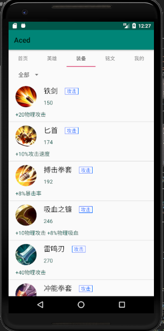
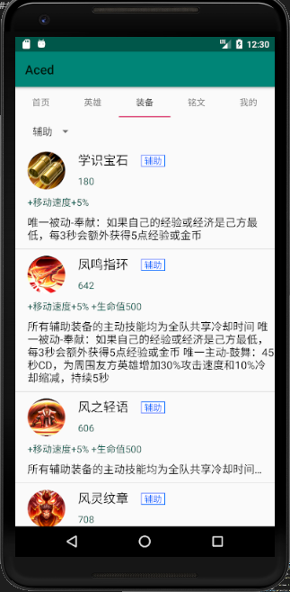

# 中山大学数据科学与计算机学院本科生实验报告
## （2018年秋季学期）
| 课程名称 | 手机平台应用开发 | 任课老师 | 郑贵锋 |
| :------------: | :-------------: | :------------: | :-------------: |
| 年级 | 2016级 | 专业（方向） | 数字媒体 |
| 学号 | 16340294 | 姓名 | 张星 |
| 电话 | 15989001410 | Email | dukestar@qq.com |
| 开始日期 | 2018.11.12 | 完成日期 | 2018.11.24

---

## 一、实验题目

### 王者荣耀英雄大全
---

## 二、实现内容

### 装备页、英雄详情下推荐铭文以及部分数据库

---

## 三、课后实验结果

### (1)实验截图

* 显示全部装备



* 显示辅助装备


* 点击被动技能后面的省略号，展开详细说明。



* 再点击，收起。


### (2)实验步骤以及关键代码

* UI。使用ListView实现装备列表，需要写Item的xml。首先是装备图片，采用圆形图实现，需要写一个类，名为*CircleImageView*，可参考网上代码。
```xml
<com.example.aced.CircleImageView
    android:id="@+id/equipmentImage"
    android:layout_width="60dp"
    android:layout_height="60dp"
    android:src="@drawable/wujinzhanren"
    app:layout_constraintLeft_toLeftOf="parent"
    app:layout_constraintTop_toTopOf="parent" />
```
* 装备类型，如攻击，防御等，我在外面套了一层边框，更加美观，将此TextView的背景设为一个定义好的边框即可。
```xml
<TextView
    android:id="@+id/equipmentType"
    android:layout_width="wrap_content"
    android:layout_height="wrap_content"
    android:layout_marginLeft="20dp"
    android:layout_marginTop="5dp"
    android:background="@drawable/textview_blueborder"
    android:paddingLeft="5dp"
    android:paddingRight="5dp"
    android:text="移动"
    android:textColor="@color/blue"
    app:layout_constraintLeft_toRightOf="@+id/equipmentName"
    app:layout_constraintTop_toTopOf="parent" />
```
* 边框文件放入drawable中，颜色可自定义。
```xml
<?xml version="1.0" encoding="utf-8"?>
<shape xmlns:android="http://schemas.android.com/apk/res/android">
    <solid android:color="#ffffff" />
    <stroke android:width="1dip" android:color="#0066ff"/>
</shape>
```
* 本次实验中我并未设置点击装备跳转到详情页面，因为它的属性太单一了，基本不能够作为一个独立的页面来显示。所以我将装备的被动技能和属性直接放入Item中，无需点击就可查看。但是若将全部信息都显示的话，ListView的Item会过长，不够美观，并且每个item的长度会不一，因为不是所有装备都有被动技能，并且被动技能的描述长度也不完全相等。所以我将其设置为：若有被动技能，则只显示一行，末尾加感叹号，点击该行，技能描述会自动展开，这样就能够更加整齐。具体实现的xml及java代码如下。XML中，设置singleLine为true，这样默认只会显示一行，然后设置ellipsize="end"，将省略号显示在行尾。
```xml
<TextView
    android:id="@+id/equipmentSkill"
    android:layout_width="match_parent"
    android:layout_height="wrap_content"
    android:singleLine="true"
    android:gravity="left"
    app:layout_constraintTop_toBottomOf="@+id/equipmentDescription"
    app:layout_constraintLeft_toLeftOf="parent"
    android:layout_marginTop="10dp"
    android:textSize="17dp"
    android:textColor="@color/black"
    android:text="唯一被动"
    android:ellipsize="end" />
```
* 然后在Adapter里面设置点击函数，若展开，则收起；已经收起，则展开。
```java
viewHolder.skill.setOnClickListener(new View.OnClickListener() {
    Boolean flag = false;
    @Override
    public void onClick(View v) {
        if(flag){
            flag = false;
            viewHolder.skill.setEllipsize(null); // 展开
            viewHolder.skill.setSingleLine(flag);
        }else{
            flag = true;
            viewHolder.skill.setEllipsize(TextUtils.TruncateAt.END); // 收缩
            viewHolder.skill.setSingleLine(flag);
        }
    }
});
```

* 接着就可以编写装备部分的代码了，首先需要新建一个装备类，用于存储装备信息，如图片，名称，被动，类型，技能等。
```java
public class Equipment implements Serializable {
    private String _equipmentName;
    private String _equipmentDescription;
    private int _equipmentId;
    private int _equipmentType;
    private int _equipmentPrice;
    private String _equipmentSkill;
    private byte[] _equipmentImage;
}
```

* 之后就需要数据库来存储装备信息。本次我们用了SQLite数据库，其中有多个表，用于存储不同的信息。
```java
CREATE_TABLE = "CREATE TABLE if not exists "
        + EQUIPMENT_TABLE
        + " ( equipmentId Integer NOT NULL PRIMARY KEY, equipName String, subEquipment Integer, salesPrice Integer, " +
        "totalPrice Integer, description String, skill String, image String)";
db.execSQL(CREATE_TABLE);
```

* 在创建数据库的时候进行数据填入，之后只需查找即可。
```java
public Equipment queryEquipmentById(Integer id){
    SQLiteDatabase db = getReadableDatabase();
    Equipment e = null;
    String selection = " equipmentId = ?";
    String[] selectionArgs = {id.toString()};
    Cursor c = db.query(EQUIPMENT_TABLE, null, selection,selectionArgs,null,null,null);
    if(c.moveToNext()){
        byte[] image = queryImage(Integer.toString(c.getInt(0)),EQUIPMENT_IMAGE_TYPE);
        e = new Equipment(c.getString(1),c.getString(5),image,c.getInt(0),c.getInt(2), c.getInt(3),c.getString(6));
    }
    c.close();
    db.close();
    return e;
}

public List<Equipment> queryAllEquipment(){
    SQLiteDatabase db = getReadableDatabase();
    List<Equipment> list = null;
    Cursor c = db.query(EQUIPMENT_TABLE, null, null, null,null,null,null);
    if(c.getCount()==0){
        db.close();
        c.close();
        return null;
    }
    list = new ArrayList<Equipment>();
    while(c.moveToNext()){
        byte[] image = queryImage(Integer.toString(c.getInt(0)),EQUIPMENT_IMAGE_TYPE);
        Equipment e = new Equipment(c.getString(1),c.getString(5),image,
                c.getInt(0),c.getInt(2), c.getInt(3),c.getString(6));
        list.add(e);
    }
    c.close();
    db.close();
    return list;
}
```

* 然后是装备页面，EquipmentPage类了。本次实验为了实现左右滑动的效果，我们使用了ViewPager类，共分五个分页面，EquipmentPage是其中之一。首先要从数据库中加载全部装备，并给ListView设置Adapter。
```java
public View getView(){
    LayoutInflater inflater = LayoutInflater.from(context);
    View viewpager = inflater.inflate(R.layout.vp_equipments, null);
    _equipments = db.queryAllEquipment();
    myEquipmentAdapter = new MyEquipmentAdapter(context,_equipments);
    ListView listView = (ListView)viewpager.findViewById(R.id.allequipment);
    spinner = (Spinner)viewpager.findViewById(R.id.spinner1);
    listView.setAdapter(myEquipmentAdapter);
    initSpinner();
    return viewpager;
}
```

* 因为装备列表太长了，查看起来很不方便。所以我此处设置了一个Spinner，用于选择不同类型的装备。

```java
public void initSpinner(){
    final String[] mItems = new String[7];
    mItems[0] = "全部";
    mItems[1] = "攻击";
    mItems[2] = "法术";
    mItems[3] = "防御";
    mItems[4] = "移动";
    mItems[5] = "打野";
    mItems[6] = "辅助";
// 建立Adapter并且绑定数据源
    ArrayAdapter<String> adapter=new ArrayAdapter<String>(context,android.R.layout.simple_spinner_item, mItems);
    adapter.setDropDownViewResource(android.R.layout.simple_spinner_dropdown_item);
//绑定 Adapter到控件
    spinner.setOnItemSelectedListener(new AdapterView.OnItemSelectedListener() {
        @Override
        public void onItemSelected(AdapterView<?> parent, View view,
                                    int pos, long id) {
            changeView(mItems[pos]);
        }
        @Override
        public void onNothingSelected(AdapterView<?> parent) {
            Toast.makeText(context,"没有选中任何选项",Toast.LENGTH_SHORT).show();
        }
    });

    spinner.setAdapter(adapter);

}
```

* 之后再编写函数，根据选择的选项来获取相对应类型的装备。由于网上所找到的数据库中，装备类型是通过数字标识，所以我们要通过一个选择来映射到对应类型。

```java
switch (str){
    case "攻击":
        i = 1;
        break;
    case "法术":
        i = 2;
        break;
    case "防御":
        i = 3;
        break;
    case "移动":
        i = 4;
        break;
    case "打野":
        i = 5;
        break;
    case "辅助":
        i = 7;
        break;
    default:
        break;
}
_equipments = db.getEquipmentByType(i);
myEquipmentAdapter.refresh(_equipments);
myEquipmentAdapter.notifyDataSetChanged();
```

* 接下来就是Adapter的编写，重点在于图片以及点击函数的设置。首先是图片，通过数据库拿到数据，转化为Bitmap类型，将其设为装备图片。
```java
byte[] image = list.get(i).getEquipmentImage();
Bitmap bmp = null;
if(image !=null)
{
    bmp = BitmapFactory.decodeByteArray(image, 0, image.length);
}
viewHolder.image.setImageBitmap(bmp);
```
* 获取装备类型，将其转化为文字显示。

```java
int temp = list.get(i).getEquipmentType();
switch (temp){
    case 1:
        viewHolder.type.setText("攻击");
        break;
    case 2:
        viewHolder.type.setText("法术");
        break;
    case 3:
        viewHolder.type.setText("防御");
        break;
    case 4:
        viewHolder.type.setText("移动");
        break;
    case 5:
        viewHolder.type.setText("打野");
        break;
    case 7:
        viewHolder.type.setText("辅助");
        break;
    default:
        break;
}
viewHolder.description.setText(list.get(i).getEquipmentDescription());
```
* 前面提到，为了装备页的美观，设置了点击收起的功能，也是在此处实现，不做赘述。若一件装备并无被动技能，则需要将它的被动属性框从UI上隐藏。
```java
str = list.get(i).getEquipmentSkill();
if(str==null){
    viewHolder.skill.setText("");
    viewHolder.skill.setVisibility(View.GONE);
}else{
    viewHolder.skill.setVisibility(View.VISIBLE);
    viewHolder.skill.setText(str);
}
```

* 还有英雄详情中的推荐铭文，此处也使用了ViewPager，推荐铭文，推荐装备以及技能，它们都复用了同一个item的xml，所以写起来并不复杂。
```java
View viewpagerD = getLayoutInflater().inflate(R.layout.viewpager_inscription, null);
TextView tv_vp_inscriptionTip = (TextView)viewpagerD.findViewById(R.id.tv_vp_inscriptionTip);
tv_vp_inscriptionTip.setText("铭文推荐: \n    "+_hero.getInscriptionsTip());
ListView lv_vp_inscription = (ListView)viewpagerD.findViewById(R.id.lv_vp_inscription);
MyViewPagerListViewAdapter myInsAdapter = new MyViewPagerListViewAdapter(this,R.layout.viewpager_listview,_inscriptions,2);
lv_vp_inscription.setAdapter(myInsAdapter);
```

* Adapter通过参数列表中最后一个参数来区分是铭文还是技能，或是装备，然后再进行详细分类。以下为获取图片。
```java
 byte[] image = _inscriptions.get(position).getInscriptionImage();
Bitmap bmp = null;
if(image !=null)
{
    bmp = BitmapFactory.decodeByteArray(image, 0, image.length);
}
holder.icon.setImageBitmap(bmp);
holder.name.setText(_inscriptions.get(position).getInscriptionName().toString());
holder.level_position_price.setText(_inscriptions.get(position).getInscriptionGrade()+"");
holder.description.setText(_inscriptions.get(position).getInscriptionDescription().toString());
```

* 同样，此处也设置了点击展开的函数，美化了UI。
```java
public void onClick(View v) {
    if(flag){
        flag = false;
        holder.description.setEllipsize(null); // 展开
        //holder.description.setLines(20);
        holder.description.setMaxLines(20);
    }else{
        flag = true;
        holder.description.setEllipsize(TextUtils.TruncateAt.END); // 收缩
        holder.description.setMaxLines(4);
    }
}
```

### (3)实验遇到的困难以及解决思路

困难一：一开始想使用圆形图标，想到之前实现的圆形Button，打算用类似的方法实现，花了好长时间也没有效果。

解决思路：上网查找了相关资料，用了一个开源的类，实现了。

困难二：设置点击展开/收起的时候，只能点开，不能收起。

解决思路：在收起时重新设置singleLine，或者MaxLines即可实现。

困难三：数据库，一开始打算在构造函数里初始化，会出现报错现象。看Log，说是递归调用之类的。

解决思路：在使用时判断数据库该表是否为空，若为空，则进行初始化操作，这样就可以避免上述操作。

困难四：装备列表，拉到最后一栏，总是显示不全，有一小部分被遮在屏幕下，并且拉不上来。

解决思路：为ListView设置paddingBottom，距离下边框距离会增加，会将隐藏部分显示出来。

---

## 五、实验思考及感想

本次实验我承担了较轻的部分，但是也是十分困难的。由于要用到ViewPager，很多不熟悉的属性要查阅资料，代码结构以及对应的xml都要进行学习。由于是小组组队，要在别人的代码里实现一些功能，也是十分有难度的，并且由于我们是先写总体UI，再实现部分，所以代码有交叉，每次pullRequest时都会出现不少冲突，需要在本地进行修改后，才能够合并。

虽然是装备页主体使用了之前已经用过的ListView，但是这次的Item中元素与之前有很大不同，不仅需要圆形图片，边框，还需要点击展开的功能，拓展了对于xml中各种元素的理解，以及其各种属性，更好地运用其功能。

至于Spinner，主要是为了方便用户查找不同类别的装备，按照我的想法，还可以分为完整装备和半成品两种，或者完整装备可以给出其合成路径，像官方助手那样。但是由于我们从网上找到的数据库文件内容有限，并没有那么详细，所以只能做到目前的这种程度。

应用的功能方面，根据文档要求的特性，我们索性直接将所有英雄的特性导入其中，后面将铭文，，装备，技能也添加了进去，后面又想技能已经添加，何不推荐铭文，装备也一并加入。最后就实现了这次的应用。功能是比文档要求的要丰富很多的，完成得也还可以，基本作为一个助手应用，是合格的。缺点就是没有使用王者荣耀的账号，不能够导入个人的数据，如战绩等，不过这也是没办法的事情。

这次作业虽然量大，并且是我们的第一次大项目，但是并没有用到很复杂的特性，如我们刚刚学到的多线程等，没有做更多的性能优化，期末项目会用更多的特性，做出更好的应用。

---

#### 作业要求
* 命名要求：学号_姓名_实验编号，例如12345678_张三_lab1.md
* 实验报告提交格式为md
* 实验内容不允许抄袭，我们要进行代码相似度对比。如发现抄袭，按0分处理