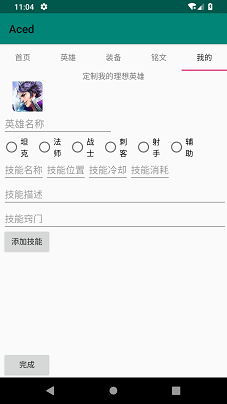
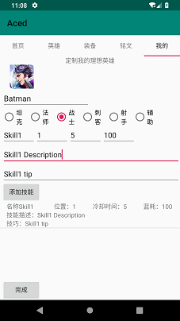
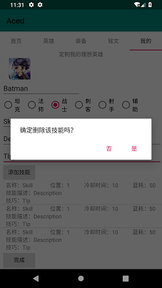
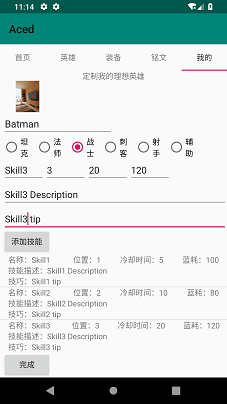
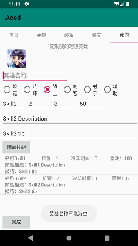
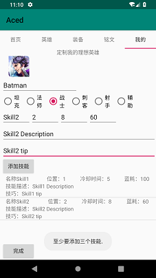
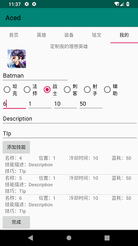
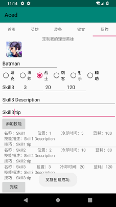

# 中山大学数据科学与计算机学院本科生实验报告
## （2018年秋季学期）
| 课程名称 | 手机平台应用开发 | 任课老师 | 郑贵锋 |
| :------------: | :-------------: | :------------: | :-------------: |
| 年级 | 2016级 | 专业（方向） | 软件工程（电子政务方向） |
| 学号 | 16340301 | 姓名 | 赵俊祥 |
| 电话 | 15920804547 | Email | 1773133512@qq.com |
| 开始日期 | 11.12 | 完成日期 |11.24|

---

## 一、实验题目 王者荣耀英雄大全

---

## 二、实现内容

- 实现viewpager中的最后一个界面—“我的”界面。
- 完成“我的”界面布局文件
- 实现增、删、改功能。用户可以根据个人喜好创建一个自己的理想英雄，修改相关属性，添加不少于三个技能，也可以删除已添加的技能。
- 设计首页，加入背景音乐播放。

---

## 三、课堂实验结果
### (1)实验截图

- 启动应用后，位于首页，上方有五个页面选项，点击“我的”或向右滑动进入“我的”界面。在“我的” 界面中，可以定制自己的理想英雄，设置英雄名称，英雄定位，添加英雄技能等。

   

- 点击添加技能按钮，可以根据填写好的技能信息，新建一个新技能;长按添加好的技能，会弹出是否删除的对话框，点击确定后可以删除已添加的技能。

   

- 点击英雄头像，可以进入手机图库，选择英雄的头像。

   

- 点击完成按钮，如果英雄名称为空或者添加的技能数少于3，会弹出提示信息。

   

- 技能列表使用listview完成，不限添加的数量。如果信息填写完整，点击完成按钮，弹出“创建成功”的信息。

  

### (2)实验步骤以及关键代码

- 整个应用使用了viewpager，可以在不切换Activity的情况下切换五个见面。“我的”界面的布局实现于vp_mine.xml中。首先，使用LinearLayout，在vp_minexml中添加头像，编辑框等控件，英雄定位的选择用RadioGroup实现，技能列表用listview实现。

- 完成总体布局后，实现listview的Adapter和每个技能的布局文件list_item_skill.xml。在MySkillAdaoter中，定义viewholder类，包含一个技能项的所有控件。保存一个list<Hero.Skill>类型的列表。重写getView方法，遍历list中的元素，把list中的元素赋给viewholder，再呈现到界面中的控件上。同时，实现一个refresh函数用于更新listview。

  ````java
  private List<Hero.Skill> list;
  @Override
  public View getView(int i, View view, ViewGroup viewGroup) {
      View convertView;
      ViewHolder viewHolder;
      // 从viewHolder中取出对应的对象，然后赋值给他们
      viewHolder.skillName.setText("名称："+ list.get(i).getSkillName());
      viewHolder.skillPosition.setText("位置："+ list.get(i).getSkillPosition());
      viewHolder.skillDescription.setText("技能描述："+ list.get(i).getSkillDescription());
      viewHolder.skillCool.setText("冷却时间：" + list.get(i).getSkillCool().toString());
      viewHolder.skillWaste.setText("蓝耗：" + list.get(i).getSkillWaste().toString());
      viewHolder.skillTip.setText("技巧："+ list.get(i).getSkillTips());
      // 将这个处理好的view返回
      return convertView;
  }
  ````

- 在MinePage.java中，获取到listview并设置Adapter。给listview添加长按事件监听器，弹出对话框，选择确定按钮后，在技能list中remove对应项，调用refresh函数进行更新。

  ````java
  mySkillAdapter = new MySkillAdapter(context,skills);
  listView = (ListView)viewpager.findViewById(R.id.listview_skill);
  listView.setAdapter(mySkillAdapter);
  ````

- 完成本地选取图片功能。给头像的Imageview添加监听器，使用Intent和startActivityForResult启动事件，给intent设置Action为ACTION_PICK，类型为“image/*”，代表选择图片。由于MinePage.java并不是activity，所以onActivityResult函数是在MainActivity中实现的。

  ````java
  Intent intent = new Intent();
  intent.setAction(Intent.ACTION_PICK);
  intent.setType("image/*");
  ((Activity)(context)).startActivityForResult(intent, 1);
  ````

- 添加技能。在按钮的监听器中，获取到各控件的值，赋给临时创建的Skill类型变量，add进list中，调用refresh函数。注意冷却时间和技能消耗这两项必须是整数，如果出现异常输入，需要进行异常处理，赋予默认值。

  ````java
  //异常处理
  Integer cool = 0;
  Integer waste = 0;
  try{
      cool = Integer.parseInt(skillCool.getText().toString());
      waste = Integer.parseInt(skillWaste.getText().toString());
  }catch (Exception e){
      e.printStackTrace();
  }
  Hero.Skill newSkill = new Hero.Skill(1,skillName.getText().toString(),skillPosition.getText().toString(),
          skillDescription.getText().toString(),cool, waste, skillTip.getText().toString());
  skills.add(newSkill);
  mySkillAdapter.refresh(skills);
  ````

- 完成按钮。进行英雄名称是否为空，技能数是否大于等于3的条件判断即可。如果满足条件，则调用Hero类的setSkills函数把技能添加到新英雄中，再用其他setter函数设置新英雄属性，最后弹出创建成功的消息。

  ````java
  idealHero.set...
  idealHero.setSkills(skills);
  ````

- 添加背景音乐。新建一个raw文件夹，存放背景音乐，用mediaPlayer.create函数创建mediaplayer。重写onUserLeaveHint和onRestart函数，实现回到home界面后停止播放音乐，唤醒后继续播放的功能。

  ````java
  mediaPlayer = MediaPlayer.create(this,R.raw.rise);
  try {
      mediaPlayer.setLooping(true);
      mediaPlayer.start();
  }catch (Exception e){
      e.printStackTrace();
  }
  @Override
  protected void onUserLeaveHint(){
      super.onUserLeaveHint();
      mediaPlayer.pause();
  }
  
  @Override
  protected void onRestart(){
      super.onRestart();
      mediaPlayer.start();
  }
  ````

  

### (3)遇到的困难和解决方法

- 本地选择图片时，无法调用startActivityForResult函数，原因是MinePage.java不是Activity，没有startActivityForResult方法。解决方法是用把context用(Activity)进行类型转换后再调用startActivityForResult函数。
- 点击完成按钮后，容易出现程序崩溃的现象，原因在于编辑框的输入可能是随机的，所以在进行冷却时间和技能蓝耗的设置时，parseInt函数出现异常。解决方法是使用try和catch进行异常处理，出现异常时赋予默认值。
- 为了让界面在不同手机呈现时不会出现过大偏差，总布局采用了LinearLayout，并给每部分设置了weight，控制好相对大小。
- 播放背景音乐时出现状态不正确的bug。原因在于使用MediaPlayer的create函数实例化mediaplayer后是处于state1的，不用再调用prepare函数。去掉prepare后问题解决。

---

## 四、实验思考及感想

本次项目我们实现了一个相当详细的英雄功能。应用启动进入首页，向右滑动可以依此进入英雄、装备、铭文、我的界面。英雄界面呈现了所有英雄，可以根据类型，定位，攻击距离等进行筛选呈现，也可以在搜索框中输入进行模糊查找。点进英雄的详情页，可以看到介绍，技能，推荐出装和推荐铭文等信息。在装备和铭文页面，可以看到所有的装备和铭文信息，同样可以设置条件进行筛选。在“我的”界面，用户可以定制自己的理想英雄，提供了增删改功能。作为一个攻略应用，我们的项目提供了非常详细的信息和人性化的搜索筛选功能，更能满足用户自己的创造需求，设计自己的英雄。本次实验由于实现的界面和功能很多，所以使用了viewpager来作为总体框架，只使用了两个Activity，避免了繁琐的数据传递。界面之间的切换也显得更加优雅。英雄信息的存储使用了数据库，实现了数据持久化。通过整个项目的开发，收获真的很多。每个人负责不同的界面，然后通过viewpager串接起来，通过分工，把数据库，UI美化等工作分离给不同的人，也提高了很多效率。在通过git进行代码的合并时，经常遇到冲突而无法合并，因此需要进行手动合并，整个过程下来，对git的操作熟练了不少，也体会到了从头到尾开发一个应用的不易。

#### 